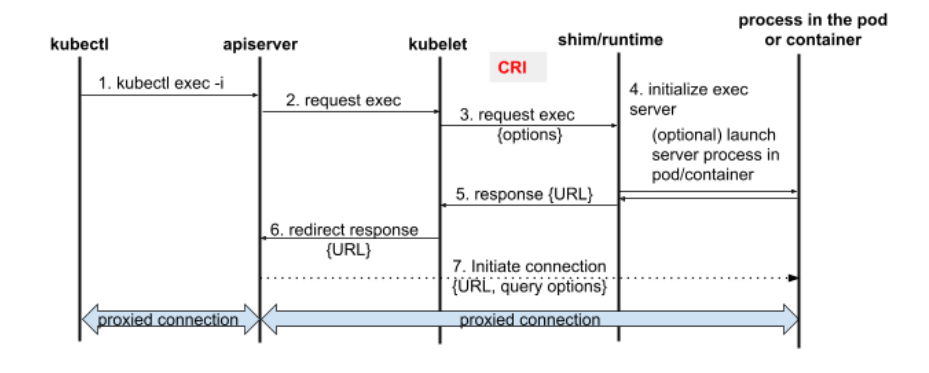
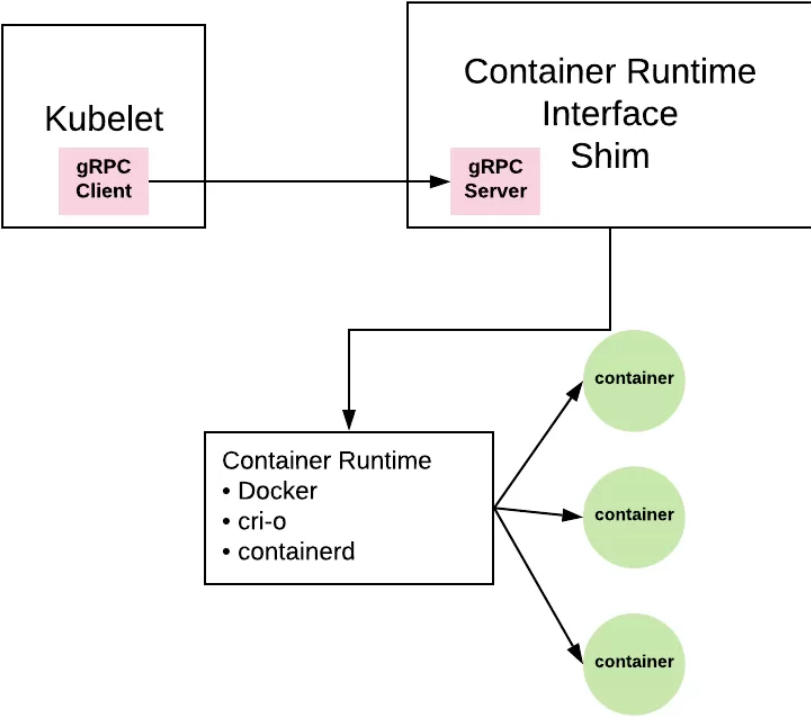
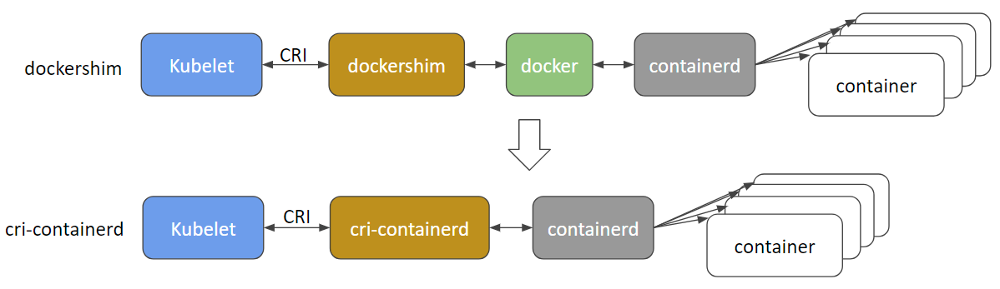
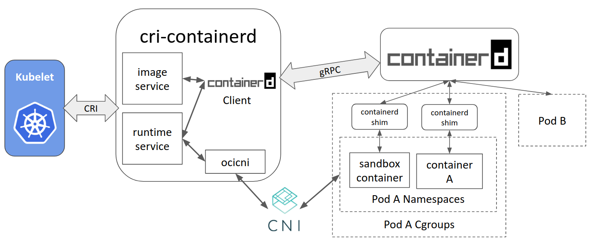

# Appendix internals

## How networking is performed 

### General

This can be set in perspective with network internals
https://matthewpalmer.net/kubernetes-app-developer/articles/kubernetes-networking-guide-beginners.html

<!--
mirrored and referenced here:
https://github.com/scoulomb/private_script/blob/main/sei-auto/certificate-doc/k8s-networking-guide/network-guide.md
-->

### Pod to pod

Now if we focus on pod to pod communication:
https://kubernetes.io/docs/concepts/cluster-administration/networking/

We understand Kubernetes network model can be implemented with several options such as:
- Calico
- Flannel

In calico doc: https://docs.projectcalico.org/about/about-kubernetes-networking we can read 
> Kubernetes built in network support, kubenet, can provide some basic network connectivity. However, it is more common to use third party network implementations which plug into Kubernetes using the CNI (Container Network Interface) API.

We had use Calico in cluster setup [here](../Setup/ClusterSetup/calico.yaml).

In flannel doc: https://github.com/coreos/flannel#flannel we can read
>  However, flannel does provide a CNI plugin for Kubernetes and a guidance on integrating with Docker.

So to implement the network they use the CNI and provide the CNI plugin:
https://docs.projectcalico.org/getting-started/kubernetes/hardway/install-cni-plugin

### CRI and CNI

Before I recommend to have some knowledge on [container engine](../container-engine/container-engine.md).
And I will take the example of cri-o which is an implementation of CRI: https://github.com/kubernetes/community/blob/master/contributors/devel/sig-node/container-runtime-interface.md

#### CRI-O

All this section is quoted from 
- https://cri-o.io/
- https://github.com/cri-o/cri-o.io/blob/master/index.md

##### What is CRI-O?

> CRI-O is an implementation of the Kubernetes CRI (Container Runtime Interface) to enable using
OCI (Open Container Initiative) compatible runtimes.
It is a lightweight alternative to using Docker as the runtime for kubernetes.

##### Architecture


> The architectural components are as follows:


>- Kubernetes contacts the kubelet to launch a pod.
>  - Pods are a kubernetes concept consisting of one or more containers sharing the same IPC, NET and PID `namespaces` and living in the same cgroup.
>- The kubelet forwards the request to the CRI-O daemon VIA kubernetes CRI (Container runtime interface) to launch the new POD.
>- CRI-O uses the `containers/image` library to pull the image from a container registry.
>- The downloaded image is unpacked into the container's root filesystems, stored in COW file systems, using containers/storage library.
>- After the rootfs has been created for the container, CRI-O generates an OCI runtime specification json file describing how to run the container using the OCI Generate tools.
>- CRI-O then launches an OCI Compatible Runtime using the specification to run the container proceses. The default OCI Runtime is runc.
>- Each container is monitored by a separate `conmon` process. The conmon process holds the `pty` of the PID1 of the container process.  It handles logging for the container and records the exit code for the container process.
>- Networking for the pod is setup through use of [CNI](https://github.com/containernetworking/cni), so any CNI plugin can be used with CRI-O.

##### Components

> CRI-O is made up of several components that are found in different GitHub repositories.

> * [OCI compatible runtime](https://github.com/opencontainers/runtime-tools)
> * [containers/storage](https://github.com/containers/storage)
> * [containers/image](https://github.com/containers/image)
> * [networking (CNI)](https://github.com/containernetworking/cni)
> * [container monitoring (conmon)](https://github.com/containers/conmon)
> * security is provided by several core Linux capabilities

In particular 

> **Networking**:The Container Network Interface [CNI](https://github.com/containernetworking/cni) is used for setting up networking for the pods.
Various CNI plugins such as Flannel, Weave and OpenShift-SDN have been tested with CRI-O and are working as expected.

> **Monitoring**: [conmon](https://github.com/cri-o/cri-o/tree/master/conmon) is a utility within CRI-O that is used to
monitor the containers, handle logging from the container process, serve attach clients and detects Out Of Memory (OOM)
situations.


#### Conclusion

Network plugin implements k8s network model by providing a plugin which uses cri-o networking.


## What happens when I do kubectl exec

Does it ssh?

It actually uses `CRI-O` to interact with the container.

Here: https://github.com/kubernetes/community/blob/master/contributors/devel/sig-node/container-runtime-interface.md, 
we can read:

> Below is a mixed list of CRI specifications/requirements, design docs and
proposals. We are working on adding more documentation for the API.

>  - [Original proposal](https://github.com/kubernetes/kubernetes/blob/release-1.5/docs/proposals/container-runtime-interface-v1.md)
>  - [Networking](kubelet-cri-networking.md)
>  - [Container metrics](cri-container-stats.md)
>  - [Exec/attach/port-forward streaming requests](https://docs.google.com/document/d/1OE_QoInPlVCK9rMAx9aybRmgFiVjHpJCHI9LrfdNM_s/edit?usp=sharing)
>  - [Container stdout/stderr logs](https://github.com/kubernetes/kubernetes/blob/release-1.5/docs/proposals/kubelet-cri-logging.md)

Which we can map to previous cri-o doc.

It seems that 
- [Exec/attach/port-forward streaming requests](https://docs.google.com/document/d/1OE_QoInPlVCK9rMAx9aybRmgFiVjHpJCHI9LrfdNM_s/edit?usp=sharing)
<=>
- [conmon](https://github.com/cri-o/cri-o/tree/master/conmon)

Quoting below what can be found in this working document: [Exec/attach/port-forward streaming requests](https://docs.google.com/document/d/1OE_QoInPlVCK9rMAx9aybRmgFiVjHpJCHI9LrfdNM_s/edit?usp=sharing)

> 


> **API specification** 

````shell script
service RuntimeService {
  ...
  rpc Exec(ExecRequest) returns (ExecResponse) {}
  rpc Attach(AttachRequest) returns (AttachResponse) {}
  rpc PortForward(PortForwardRequest) returns (PortForwardResponse) {}
  ...
}

message ExecRequest {
  // The id of the container
  optional string container_id = 1;
  // The cmd to execute
  repeated string cmd = 2;
  // Whether use tty
  optional bool tty = 3;
  // Streaming stdin
  optional bytes stdin = 4;
}

````

See https://github.com/kubernetes/kubernetes/pull/35008/commits/be7834dc4a46d102f5b195845a2615d040a426a4
and : https://github.com/kubernetes/kubernetes/blob/master/staging/src/k8s.io/cri-api/pkg/apis/runtime/v1/api.proto#L96


We can see that when dong `kubectl exec`, 
Kubelet make a grpc call, using interface specified in the CRI, implemented for instance by CRI-o.

More details on this topic can be found here:
- https://kubernetes.io/blog/2016/12/container-runtime-interface-cri-in-kubernetes/
- https://erkanerol.github.io/post/how-kubectl-exec-works/
- https://itnext.io/how-it-works-kubectl-exec-e31325daa910 (here they use dockershim)

## Going furrther

Note that there is the shim.
From: https://www.threatstack.com/blog/diving-deeper-into-runtimes-kubernetes-cri-and-shims
> The shim sits between the container manager and a runtime to facilitate communication and prevent integration problems that may arise


From there: https://www.programmableweb.com/news/grpc-real-world-kubernetes-container-runtime-interface/analysis/2020/10/26
It is shown in this diagram:

.

See also dockershim in: [container engine](../container-engine/container-engine.md).

Also this consistent with this quote: 
https://blog.alterway.fr/le-point-sur-les-container-runtimes.html
> CRI-O est un autre exemple de runtime qui implémente CRI (cri-o and its shim) 
>et communique ensuite avec une autre runtime (container runtime)
> qui implémente elle la spécification de l'OCI. 
> CRI-O peut, par exemple, parler à runc ou à Kata Containers.

So so cri-o talks to runc which talks to container
In short

- 1/ `kubelet -> crio-shim (CRI implem) -> cri-o -> runc (OCI Implem) -> containers `

Similarly 
- 2/ `kubelet -> dockershim (CRI implem) ->  docker -> contenaird (OCI Implem) -> runc (OCI Implem) -> containers`
and
- 3/ `kubelet -> container-d shim (CRI implem) ->  contenaird -> runc (OCI Implem) -> containers`

Compliant with [container engine](../container-engine/container-engine.md), and illustration above.

However reading this article we have
from: https://www.learnsteps.com/docker-components-and-how-they-interact.
`dockerd -> contenaird -> contenaird-shim -> runc -> containers`
And it shows same description here: http://alexander.holbreich.org/docker-components-explained/

But last blog points to this official link in k8s blog
https://kubernetes.io/blog/2017/11/containerd-container-runtime-options-kubernetes/#cri-containerd

Which reflects exactly what I described in 2/ and 3/, and explain why they stop supporting 2/ (dockershim) 
So my description the real implementation.

I will quote k8s blog which summarizes everything so far

> ### cri-containerd
> Cri-containerd is exactly that: an implementation of CRI for containerd. It operates on the same node as the Kubelet and containerd. Layered between Kubernetes and containerd, cri-containerd handles all CRI service requests from the Kubelet and uses containerd to manage containers and container images. Cri-containerd manages these service requests in part by forming containerd service requests while adding sufficient additional function to support the CRI requirements.



> Compared with the current Docker CRI implementation (dockershim), cri-containerd eliminates an extra hop in the stack, making the stack more stable and efficient.

> ### Architecture

> Cri-containerd uses containerd to manage the full container lifecycle and all container images. As also shown below, cri-containerd manages pod networking via CNI (another CNCF project)



> Let’s use an example to demonstrate how cri-containerd works for the case when Kubelet creates a single-container pod:

> 1. Kubelet calls cri-containerd, via the CRI runtime service API, to create a pod;
> 2. cri-containerd uses containerd to create and start a special pause container (the sandbox container) and put that container inside the pod’s cgroups and namespace (steps omitted for brevity);
> 3. cri-containerd configures the pod’s network namespace using CNI;
> 4. Kubelet subsequently calls cri-containerd, via the CRI image service API, to pull the application container image;
> 5. cri-containerd further uses containerd to pull the image if the image is not present on the node;
> 6. Kubelet then calls cri-containerd, via the CRI runtime service API, to create and start the application container inside the pod using the pulled container image;
> 7. cri-containerd finally calls containerd to create the application container, put it inside the pod’s cgroups and namespace, then to start the pod’s new application container. After these steps, a pod and its corresponding application container is created and running.

Then runc seems to use socket 
- https://github.com/opencontainers/runc/blob/master/exec.go#L35
- https://github.com/opencontainers/runc/commit/7df64f88866962d3ee56dc67039f0ea1e13c49cd

A socket needs a port: https://github.com/scoulomb/http-over-socket/blob/main/1-client/main.py#L90

Quoting [container engine](../container-engine/container-engine.md#kubernetes-will-deprecate-docker).
> But as Docker produce OCI compliant image, those engine (contenaird, cri-o) will be able to run Docker image.

Indeed the fact docker, podman produces OCI compliant image explain why those images can be run by Kubernetes
using cri-o, contenaird and docker.

Thus even if k8s stops supporting docker, k8s can continue to run image produced by Docker using contenaird and CRI-O.
When k8s uses containerd, it even uses the same container engine as Docker.

## How liveness and readiness probes are implemented?

<!--
https://stackoverflow.com/questions/65962572/how-does-kubernetes-probe-work-under-the-hood
-->

Assume we define a liveness or readiness probes using a HTTP request.
Example for this is given in Kubernetes documentation here.

How does the Kubelet perform the health check?

- Does it use the POD IP? but given that we can also perform the liveness via a command. I think the mechanism is different as it would not be consistent?
- Does it use the Container Runtime Interface (CRI) ?

It actually uses the same mechanism as `kubectl exec`:

From https://stackoverflow.com/questions/60839481/how-does-a-liveness-readiness-probe-communicate-with-a-pod
> For network probes, they are run from the kubelet on the node where the pod is running. Exec probes are run via the same mechanism as kubectl exec.

<!-- do not confuse with
https://kubernetes.io/blog/2018/10/01/health-checking-grpc-servers-on-kubernetes/
-->

<!-- lien question DL -->

So we could need a port.

## Note on several container in same pod

<!-- link conf eng deployment -->

In same pod we can use localhost between different containers.
They share the same network namespace.
This is possible via the pause container: https://stackoverflow.com/questions/48651269/what-are-the-pause-containers

> The 'pause' container is a container which holds the network namespace for the pod. Kubernetes creates pause containers to acquire the respective pod’s IP address and set up the network namespace for all other containers that join that pod.

A consequence is that 2 container in same pod can not bind the same port.

See:
- https://stackoverflow.com/questions/58713651/2-containers-using-the-same-port-in-kubernetes-pod
- https://stackoverflow.com/questions/54289786/dual-nginx-in-one-kubernetes-pod

Note it would be a very bad idea to scale a container by adding several time the same container in same pod
(example of 1 side-car for several time the same container), because it would reduce also the nodes where it could be scheduled
And it would lead to a port issue.Better to have separate pod.

Overhead of additional pod is the pause container.


<!--
## certificate 

lien certificate tls for pod to pod
but not container to container
https://github.com/scoulomb/private_script/blob/main/sei-auto/certificate.md
-->

<!-- 

## dl
- lb on top of nodeport which is on top of cluster ip. I was right.
OK
- port on pod can be different than service, see service target port
OK
- liveness is not using a port directy,
not the rpc call is done between kubelet and shim 
OK
- https://github.com/scoulomb/myDNS/blob/master/2-advanced-bind/5-real-own-dns-application/6-use-linux-nameserver-part-g.md#step-4-deploy-in-kubernetes-with-nodeport
In browser we have certificate exception and can add a root CA that we trust 
Similarly here: https://github.com/scoulomb/private_script/blob/main/infoblox_throughput/README.md
ESB can also trust 
For inbound we can offload in ESB, F5, ingress
OK
- https://github.com/scoulomb/myDNS/blob/master/2-advanced-bind/5-real-own-dns-application/6-use-linux-nameserver-part-g.md#step-5b--deploy-using-kubernetes-ingress-with-https-and-fix-case-2
referenced in  in https://github.com/scoulomb/private_script in certificate.md 
OK CLEAR and also part g, and already there OK

- TLS layer

see here which layer is TLS:
https://raw.githubusercontent.com/scoulomb/private_script/ in certificate.md
also mentioned here
https://raw.githubusercontent.com/scoulomb/http-over-socket/master/2-server/README.md

OK STOP
> ALL OK STOP

-->

<!-- all this section + container engine concluded with feb 2021 knowledge -->

## Other doc 

This video explains same concept:
https://www.youtube.com/watch?v=7KUdmFyefSA

I like the fact they that:
- what is actually decommissioned is the Shim
- the fact docker produce OCI, it can be run by any container engine as mention here in [Architecture](#architecture).
- Something I did not know: a project will maintain Dockershim separately (outside k8s)
- perspective what to do if
    - dev: nothing
    - managed k8s: nothing 
    - deploy own k8s: some changes
    
<!-- clear and aligned STOP - no dive -->