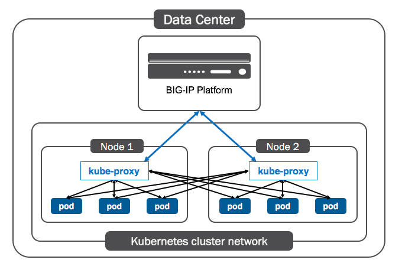
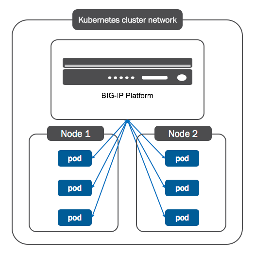

# F5 integration 

Disclaimer: this is my current understanding, browsing the doc

In this page we will describe F5 integration with K8s.
We will cover in particular this 3 [k8s/os objects](https://clouddocs.f5.com/products/connectors/k8s-bigip-ctlr/v1.9/):
- F5 resource CM
- K8s Ingress
- OpenShift route

> The k8s-bigip-ctlr watches the Kubernetes API for the creation, modification, or deletion of Kubernetes objects. For some Kubernetes objects, the Controller responds by creating, modifying, or deleting objects in the BIG-IP system

## Declarative API

This integration relies on `k8s big-ip controller` which rely on AS3 declarative API (opposed to imperative).
This can be seen in pre-requisite here: https://clouddocs.f5.com/products/connectors/k8s-bigip-ctlr/v1.9/#installation.
This is also visible in the code: https://github.com/F5Networks/k8s-bigip-ctlr/blob/master/cmd/k8s-bigip-ctlr/main.go#L55

## k8s integration

### Controller Mode

k8s controller can work in 2 modes:
This is documented in [F5 cloud docs](https://clouddocs.f5.com/containers/v2/kubernetes/kctlr-modes.html)

#### F5 NodePort Mode

This is F5 implementation looks like proposal here: [service_deep_dive](./service_deep_dive.md#Node-port-alternative).

The NodePort mode uses 2-tier load balancing:
1. The BIG-IP Platform load balances requests to Nodes (kube-proxy).
2. Nodes (kube-proxy) load balance requests to Pods.


Image from [F5 cloud doc website](https://clouddocs.f5.com/containers/v2/kubernetes/kctlr-modes.html)

#### F5 cluster mode

In that case F5 is sending request to POD directly. 
It is mentioned we  `can use any type of Kubernetes Services.`


Image from [F5 cloud doc website](https://clouddocs.f5.com/containers/v2/kubernetes/kctlr-modes.html)

### Options

#### ConfigMap

As explained in this page: https://clouddocs.f5.com/containers/v2/kubernetes/kctlr-deploy-iapp.html
We can define a config map in the form of:

````json
{
  "virtualServer": {
    "backend": {
      "serviceName": "myService",
      "servicePort": 80
    },
    "frontend": {
      "partition": "k8s",
      "iapp": "/Common/f5.http",
      "iappPoolMemberTable": {
        "name": "pool__members",
        "columns": [
            {"name": "addr", "kind": "IPAddress"},
            {"name": "port", "kind": "Port"},
            {"name": "connection_limit", "value": "0"}
        ]
      },
      "iappOptions": {
        "description": "myService_f5.http iApp"
      },
      "iappVariables": {
        "monitor__monitor": "/#create_new#",
        "monitor__response": "none",
        "monitor__uri": "/",
        "net__client_mode": "wan",
        "net__server_mode": "lan",
        "pool__addr": "127.0.0.2",
        "pool__pool_to_use": "/#create_new#",
        "pool__port": "4430"
      }
    }
  }
}
````
The `k8s big-ip controller` will create a `VirtualServer` on the F5.

#### F5 ingress 

Doc:
- https://clouddocs.f5.com/containers/v2/kubernetes/kctlr-ingress.html
- https://clouddocs.f5.com/containers/v2/kubernetes/kctlr-k8s-ingress-ctlr.html

F5 k8s controller can be used instead of a Traefik ingress controller.
It will:
> [creates a shared virtual server with one pool for each [f5] Ingress resource](https://clouddocs.f5.com/containers/v2/kubernetes/kctlr-k8s-ingress-ctlr.html#set-a-default-shared-ip-address)

It gives an IP based on DNS look up or IPAM.

Example:

````yaml
apiVersion: extensions/v1beta1
kind: Ingress
metadata:
  name: myingress
  annotations:
    nginx.ingress.kubernetes.io/rewrite-target: /
    kubernetes.io/ingresslass: "f5"
    virtual-server.f5.com/ip: "controller-default"
    virtual-server.f5.com/http-port: "443"
    virtual-server.f5.com/partition: "k8s"
    virtual-server.f5.com/balance: "round-robin"
    virtual-server.f5.com/health: '[{"path": "svc1.example.com/app1", "send": "HTTP GET /health/svc1", "interval": 5, "timeout": 10}]'
    ingress.kubernetes.io/ssl-redirect: "true"
    ingress.kubernetes.io/allow-http: "false"
spec:
  rules:
  - http:
      paths:
      - path: /testpath
        backend:
          serviceName: test
          servicePort: 80
````

This is the same as Traefik except that each ingress resource has its own virtual ip (then routing performed to endpoint using vhost)
The main difference with Traefik is that we expose directly the VIP, so we do not need to load balance on k8s node, and the use Traefkik.
So we removed another level of indirection here [service_deep_dive](./service_deep_dive.md#Ingress): the step 2.

We are doing host and name based routing: https://clouddocs.f5.com/containers/v2/kubernetes/kctlr-k8s-ingress-ctlr.html#set-a-default-shared-ip-address
More details on [host/named based routing](https://devcentral.f5.com/s/articles/the-three-http-routing-patterns-you-should-know-30764 )

So here accumulated with F5 cluster mode no indirection at all is done! 

Aligned with second part of the answer in [SO](https://stackoverflow.com/questions/60031377/load-balancing-in-front-of-traefik-edge-router).

As for Traefik `k8s big-ip controller` is able to perform only [`name based virtual hosting`](https://clouddocs.f5.com/containers/v2/kubernetes/kctlr-ingress.html#name-based-virtual-hosting).

## OpenShift integration

F5 can replace [OpenShift route/HA proxy](https://docs.okd.io/latest/architecture/networking/assembly_available_router_plugins.html#architecture-haproxy-router) as documented [in F5 doc](https://clouddocs.f5.com/containers/v2/openshift/#openshift-routes).

This the F5 BIG-IP Controller for Kubernetes.  We have a  mapping between OpenShift operations and F5.

- Create OpenShift Route 	
    - Creates two virtual servers (HTTP and HTTPS)
    - Creates pools and pool members with policies attached.
    - Attaches defined policies to virtual servers.

- Add/remove endpoints 	
    - Adds/removes pool members corresponding to the endpoints from the Route’s pool.

- Delete Routes 
    - Removes all BIG-IP objects associated with the Routes: Virtual servers, pools, and policies.

We can wonder what is the VIP? what is the VIP? I guess it is doing named based routing.
) and not host based as we usually do.

→  concept of service discovery / pool update based on OpenShift resource interesting.

## Wrap-up

Given this question:
 > [I am quite confused about the roles of Ingress and Load Balancer in Kubernetes.](https://stackoverflow.com/questions/45079988/ingress-vs-load-balancer?rq=1).

We can map following concepts:

- Load Balancer: [service_deep_dive](./service_deep_dive.md#LoadBalancer),
- Ingress: [service_deep_dive](./service_deep_dive.md#Ingresses),
> A LoadBalancer service could listen for ingress rules, if it is configured to do so.
My interpretation is that it the same as [F5 ingress](#F5-ingress).
- NodePort: [service_deep_dive](./service_deep_dive.md#NodePort),
>  This could be an Ingress Controller.
> My interpretation of that sentence is what we did [here](./service_deep_dive.md#Create-deployments-and-services), where one of the svc was a NodePort.


## Note on deprecated [F5 big ip router plugin](https://docs.okd.io/latest/architecture/networking/assembly_available_router_plugins.html#architecture-f5-big-ip)

From [okd doc](https://docs.okd.io/latest/architecture/networking/assembly_available_router_plugins.html#architecture-f5-big-ip) 
>The F5 BIG-IP Router plug-in is one of the available router plugins.)

 But actually this F5 router is deprecated. From [okd doc](https://docs.okd.io/latest/install_config/router/f5_router.html#overview)
> The F5 router plug-in will be deprecated in OKD version 3.11. The functionality of the F5 router plug-in is replaced in the F5 BIG-IP® Controller for OpenShift. 

## Going further

- F5 lab: https://readthedocs.org/projects/f5-101-lab-kubernetes-agility17/downloads/pdf/master/
- Cluster federation: https://github.com/kubernetes/community/blob/master/contributors/design-proposals/multicluster/federation.md