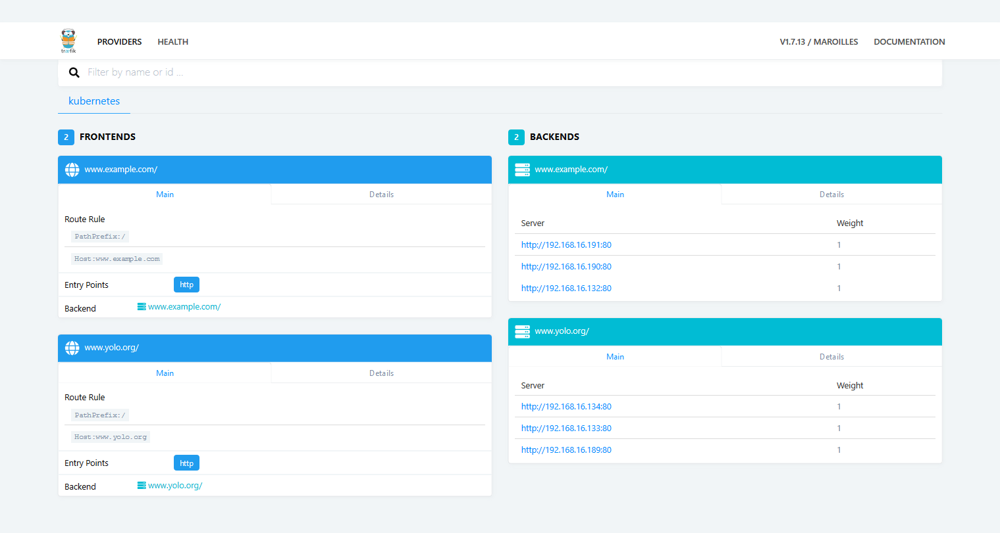
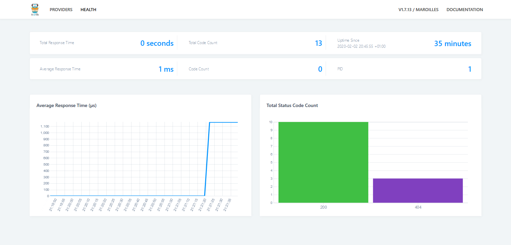

# Service deep dive

## Clean up

```
k delete svc,deployment --all
k create deployment deploy1 --image=nginx
```

## Each pod has an IP

```
vagrant@k8sMaster:~$ ip a | grep inet
    inet 127.0.0.1/8 scope host lo
    inet6 ::1/128 scope host
    inet 10.0.2.15/24 brd 10.0.2.255 scope global dynamic eth0

vagrant@k8sMaster:~$ k get pods -o wide
NAME                       READY   STATUS    RESTARTS   AGE   IP               NODE        NOMINATED NODE   READINESS GATES
deploy1-5d98f66655-8gffz   1/1     Running   0          72s   192.168.16.171   k8smaster   <none>

```

We will export `POD_NAME` and `POD_IP`.

```
export POD_NAME=$(k get pods -o wide | grep "deploy1-" |  awk '{ print $1 }')
export POD_IP=$(k get pods -o wide | grep "deploy1-" |  awk '{ print $6 }')
```

We can target pod ip directly

```
vagrant@k8sMaster:~$  curl --silent http://$POD_IP | grep "<title>"
<title>Welcome to nginx!</title>
```

## Use service

Rather than targeting pod directly we can use service
Pod is linked to a service via a label in selector as it can be shown here:

```
vagrant@k8sMaster:~$ k describe pod $POD_NAME | grep -A 1 "Labels"
Labels:       app=deploy1
              pod-template-hash=5d98f66655


vagrant@k8sMaster:~$ k expose deployment deploy1 --port=80 --type=ClusterIP --dry-run -o yaml | grep -A 2 "selector"
  selector:
    app: deploy1
  type: ClusterIP

k expose deployment deploy1 --port=80 --type=ClusterIP 

```

We can use service to target the pod using the cluster ip.

```
vagrant@k8sMaster:~$ k get svc
NAME         TYPE        CLUSTER-IP       EXTERNAL-IP   PORT(S)   AGE
deploy1      ClusterIP   10.100.200.199   <none>        80/TCP    5s


vagrant@k8sMaster:~$ export CLUSTER_IP=$(k get svc | grep "deploy1" |  awk '{ print $3 }')
vagrant@k8sMaster:~$ echo $CLUSTER_IP
10.100.200.199

vagrant@k8sMaster:~$ curl --silent http://$CLUSTER_IP | grep "<title>"
<title>Welcome to nginx!</title>

````

Endpoint controller created corresponding endpoints:
https://github.com/kubernetes/kubernetes/blob/master/pkg/controller/endpoint/endpoints_controller.go#L200

This is possible because from [k8s doc](https://kubernetes.io/docs/concepts/services-networking/service/)
> The controller for the Service selector continuously scans for Pods that match its selector, and then POSTs any updates to an Endpoint object also named “my-service”.

```
vagrant@k8sMaster:~$ k get ep | grep "deploy1"
deploy1      192.168.16.171:80   3m33s
````

When scaling deployment, it creates other ep and load balance the traffic
We scale by doing `k scale --replicas=3 deployment/deploy1`


And check new endpoints

```
vagrant@k8sMaster:~$ k get pods -o wide | grep "deploy1-"
deploy1-5d98f66655-8gffz   1/1     Running   0          22m   192.168.16.171   k8smaster   <none>
        <none>
deploy1-5d98f66655-qnr5s   1/1     Running   0          26s   192.168.16.173   k8smaster   <none>
        <none>
deploy1-5d98f66655-skf26   1/1     Running   0          26s   192.168.16.172   k8smaster   <none>
        <none>

vagrant@k8sMaster:~$ k get ep | grep "deploy1"
deploy1      192.168.16.171:80,192.168.16.172:80,192.168.16.173:80   5m5s
```

## Service internal

`kube-proxy` watches endpoints and services to updates iptable and thus redirect to correct pod.

It has several [modes](https://kubernetes.io/docs/concepts/services-networking/service/#virtual-ips-and-service-proxies)
- user space proxy
- ip table proxy :update ip table based on service cluster ip (virtual server) and endpoints (pool members)
- ipvs (netlinks)

We use below ip table.

It is running inside a Pod

````
vagrant@k8sMaster:~$ k -n kube-system logs kube-proxy-wkxs6
W0202 11:39:49.644676       1 server_others.go:329] Flag proxy-mode="" unknown, assuming iptables proxy
````


We can see updated iptable ! as documented in [doc](https://kubernetes.io/docs/tasks/debug-application-cluster/debug-service/#iptables)

````
vagrant@k8sMaster:~$ sudo iptables-save | grep  10.100.200.199
-A KUBE-SERVICES ! -s 192.168.0.0/16 -d 10.100.200.199/32 -p tcp -m comment --comment "default/deploy1: cluster IP" -m tcp --dport 80 -j KUBE-MARK-MASQ
-A KUBE-SERVICES -d 10.100.200.199/32 -p tcp -m comment --comment "default/deploy1: cluster IP" -m tcp --dport 80 -j KUBE-SVC-HFJG5QJDKA2NKYX2

vagrant@k8sMaster:~$ sudo iptables-save | grep  KUBE-SVC-HFJG5QJDKA2NKYX2
:KUBE-SVC-HFJG5QJDKA2NKYX2 - [0:0]
-A KUBE-SERVICES -d 10.100.200.199/32 -p tcp -m comment --comment "default/deploy1: cluster IP" -m tcp --dport 80 -j KUBE-SVC-HFJG5QJDKA2NKYX2
-A KUBE-SVC-HFJG5QJDKA2NKYX2 -m statistic --mode random --probability 0.33332999982 -j KUBE-SEP-IVTV3JKMDAKRFCBH
-A KUBE-SVC-HFJG5QJDKA2NKYX2 -m statistic --mode random --probability 0.50000000000 -j KUBE-SEP-PFJDNPXONEKPWG5A
-A KUBE-SVC-HFJG5QJDKA2NKYX2 -j KUBE-SEP-SIUA6YONSJ3WPF22

vagrant@k8sMaster:~$ sudo iptables-save | grep 192.168.16.17
-A KUBE-SEP-IVTV3JKMDAKRFCBH -s 192.168.16.171/32 -j KUBE-MARK-MASQ
-A KUBE-SEP-IVTV3JKMDAKRFCBH -p tcp -m tcp -j DNAT --to-destination 192.168.16.171:80
-A KUBE-SEP-PFJDNPXONEKPWG5A -s 192.168.16.172/32 -j KUBE-MARK-MASQ
-A KUBE-SEP-PFJDNPXONEKPWG5A -p tcp -m tcp -j DNAT --to-destination 192.168.16.172:80
-A KUBE-SEP-SIUA6YONSJ3WPF22 -s 192.168.16.173/32 -j KUBE-MARK-MASQ
-A KUBE-SEP-SIUA6YONSJ3WPF22 -p tcp -m tcp -j DNAT --to-destination 192.168.16.173:80
````

## Svc discovery by environment variable or DNS within a POD

````
vagrant@k8sMaster:~$ k get svc
NAME         TYPE        CLUSTER-IP       EXTERNAL-IP   PORT(S)   AGE
deploy1      ClusterIP   10.100.200.199   <none>        80/TCP    47m
````

Create a client pod `deploy-test` to target nginx service previously created (also using nginx image)
In snippet below, within a container in that pod we do:
- service discovery by environment var
- Followed by [DNS](https://kubernetes.io/docs/concepts/services-networking/service/#dns). DNS is pointing to `cluster ip`.

````
k create deployment deploy-test --image=nginx
k exec -it deploy-test-854bc66d47-tptt9 -- /bin/bash
root@deploy-test-854bc66d47-tptt9:/# apt-get update
root@deploy-test-854bc66d47-tptt9:/# apt-get install curl
root@deploy-test-854bc66d47-tptt9:/# env | grep DEPLOY1_
DEPLOY1_PORT=tcp://10.100.200.199:80
DEPLOY1_PORT_80_TCP=tcp://10.100.200.199:80
DEPLOY1_PORT_80_TCP_PORT=80
DEPLOY1_SERVICE_HOST=10.100.200.199
DEPLOY1_SERVICE_PORT=80
DEPLOY1_PORT_80_TCP_PROTO=tcp
DEPLOY1_PORT_80_TCP_ADDR=10.100.200.199
root@deploy-test-854bc66d47-tptt9:/# curl --silent $DEPLOY1_SERVICE_HOST:$DEPLOY1_SERVICE_PORT | grep "<title>"
<title>Welcome to nginx!</title>
root@deploy-test-854bc66d47-tptt9:/# curl --silent deploy1 |  grep "<title>"
<title>Welcome to nginx!</title>
root@deploy-test-854bc66d47-tptt9:/#

````

Why service discovery by env var is dangerous?

If now I delete the service and recreate the service

````
k delete svc deploy1
k expose deployment deploy1 --port=80 --type=ClusterIP 

vagrant@k8sMaster:~$ k get svc
NAME         TYPE        CLUSTER-IP      EXTERNAL-IP   PORT(S)   AGE
deploy1      ClusterIP   10.96.121.165   <none>        80/TCP    7s
````

Cluster IP has changed from `10.100.200.199` to `10.96.121.165`

Thus service discovery by environment var stop working, while DNS one is working
 
````
vagrant@k8sMaster:~$ k exec -it deploy-test-854bc66d47-tptt9 -- /bin/bash
root@deploy-test-854bc66d47-tptt9:/# root@deploy-test-854bc66d47-tptt9:/# curl --max-time 10 $DEPLOY1_SERVICE_HOST:$DEPLOY1_SERVICE_PORT | grep "<title>"
  % Total    % Received % Xferd  Average Speed   Time    Time     Time  Current
                                 Dload  Upload   Total   Spent    Left  Speed
  0     0    0     0    0     0      0      0 --:--:--  0:00:10 --:--:--     0
curl: (28) Connection timed out after 10001 milliseconds
root@deploy-test-854bc66d47-tptt9:/# curl --silent --max-time 10 deploy1 | grep "<title>"
<title>Welcome to nginx!</title>
````

If I scale the client 

````
k scale --replicas=3 deployment/deploy-test
root@deploy-test-854bc66d47-tptt9:/# echo $DEPLOY1_SERVICE_HOST
10.100.200.199
root@deploy-test-854bc66d47-rfhmt:/# echo $DEPLOY1_SERVICE_HOST
10.96.121.165
````

Only new pods have the new IP (if service created after pod creation it does not know it). So env var discovery forces to expose service before deploying client pod
This ordering issue is documented here: https://kubernetes.io/docs/concepts/services-networking/service/#discovering-services
> When you have a Pod that needs to access a Service, and you are using the environment variable method to publish the port and cluster IP to the client Pods, you must create the Service before the client Pods come into existence. Otherwise, those client Pods won’t have their environment variables populated.

If we modify the service a redeployment is needed. 

It is even said: "You can (and almost always should) set up a DNS service for your Kubernetes cluster using an add-on."

Eventually service DNS name can templatized using Helm values (or OpenShift template parameters)
and used as environment variable 

## Within a container

It is also possible to target a service inside a container

```
vagrant@k8sMaster:~$ k exec -it deploy-test-854bc66d47-tptt9 -- /bin/bash
root@deploy-test-854bc66d47-tptt9:/#  curl --silent 127.0.0.1 | grep "<title>"
<title>Welcome to nginx!</title>
````
## Use a different port 

```
k delete svc deploy1
k expose deployment deploy1 --port=5000 --target-port=80 --type=ClusterIP
````

otherwiswe by default `port = target port`
Then 

```
vagrant@k8sMaster:~$ k get svc
NAME         TYPE        CLUSTER-IP      EXTERNAL-IP   PORT(S)    AGE
deploy1      ClusterIP   10.103.100.13   <none>        5000/TCP   2m9s

vagrant@k8sMaster:~$ curl --silent 10.103.100.13:5000 | grep "<title>"
<title>Welcome to nginx!</title>
````
target-port can be a "named port"
https://kubernetes.io/docs/concepts/services-networking/service/#defining-a-service
So different pod could use a different port (not tested)


## Other type of service

Service we have seen above is `ClusterIP`.

### NodePort

NodePort is a simple connection from a high-port routed to a ClusterIP 
The NodePort is accessible via calls to <NodeIP>:<NodePort>.

To ensure NodePort is in the range of port forwarded by the VM, we will add [following line](http://www.thinkcode.se/blog/2019/02/20/kubernetes-service-node-port-range) `--service-node-port-range=32000-32000` in command section of `/etc/kubernetes/manifests/kube-apiserver.yaml`

This will restart api-server (see 24s in command below).

````
vagrant@k8sMaster:~$  kubectl get pods -n kube-system
NAME                                       READY   STATUS    RESTARTS   AGE
calico-kube-controllers-6b9d4c8765-f988d   1/1     Running   3          3d5h
calico-node-z4hzv                          1/1     Running   3          3d5h
coredns-5644d7b6d9-5djh9                   1/1     Running   3          3d5h
coredns-5644d7b6d9-xp79t                   1/1     Running   3          3d5h
etcd-k8smaster                             1/1     Running   3          3d5h
kube-apiserver-k8smaster                   1/1     Running   0          24s
````

Alternative is to specify the `NodePort` directly:
https://kubernetes.io/docs/reference/generated/kubernetes-api/v1.17/#servicespec-v1-core
> `nodePort:Integer`: The port on each node on which this service is exposed when type=NodePort or LoadBalancer. Usually assigned by the system. If specified, it will be allocated to the service if unused or else creation of the service will fail. Default is to auto-allocate a port if the ServiceType of this Service requires one. More info: https://kubernetes.io/docs/concepts/services-networking/service/#type-nodeport


````
k delete svc deploy1
vagrant@k8sMaster:~$ k expose deployment deploy1 --port=80 --type=NodePort
service/deploy1 exposed
vagrant@k8sMaster:~$ k get svc
NAME         TYPE        CLUSTER-IP      EXTERNAL-IP   PORT(S)        AGE
deploy1      NodePort    10.97.110.238   <none>        80:32000/TCP   7s
kubernetes   ClusterIP   10.96.0.1       <none>        443/TCP        3h3m
vagrant@k8sMaster:~$
````

Thus we can now target this svc as cluster ip, but also using node ip

````
# From master node
vagrant@k8sMaster:~$ curl --silent 10.0.2.15:32000 | grep "<title>"
<title>Welcome to nginx!</title>
vagrant@k8sMaster:~$ curl --silent 127.0.0.1:32000 | grep "<title>"
<title>Welcome to nginx!</title>
vagrant@k8sMaster:~$ curl --silent 127.0.0.1:32001 | grep "<title>"

````
We can target outside from the VM.
This is equivalent to target ip address of the node from the outside

This is working because of port forwarding define in Vagrant file as follows:
`k8sMaster.vm.network "forwarded_port", guest: 32000, host: 32000, auto_correct: true`

Output is:
````
scoulomb@XXXXX MINGW64 ~
$ curl --silent 127.0.0.1:32000 | grep  "<title>"
<title>Welcome to nginx!</title>
````
### LoadBalancer

Doc: https://kubernetes.io/docs/tasks/access-application-cluster/create-external-load-balancer/

Creating a LoadBalancer service generates a NodePort.
It sends an asynchronous call to an external load balancer, 
Usually one of a cloud provider. 
The External-IP value will remain in a <Pending> state until the load balancer returns. 
It is only used to load balancer inside a PAAS. 

````
k delete svc deploy1
k expose deployment deploy1 --port=80 --type=LoadBalancer
````

Note the pending and the fact it behave as cluster ip

````
vagrant@k8sMaster:~$ k get svc
NAME         TYPE           CLUSTER-IP     EXTERNAL-IP   PORT(S)        AGE
deploy1      LoadBalancer   10.111.52.75   <pending>     80:32000/TCP   15s
kubernetes   ClusterIP      10.96.0.1      <none>        443/TCP        3h13m
vagrant@k8sMaster:~$ curl --silent 10.111.52.75 | grep "<title>"
<title>Welcome to nginx!</title>

````

It will load balancer on cluster nodes.
There will be two pool members associated with the load balancer: 
These are the IP addresses of the nodes in the Kubernetes cluster.

We could setup load balancer manually.

### Note on load balancer svc

<!-- discussion dl jum2020 -->

````shell script
➤ k create service loadbalancer my-lbs --tcp=5678:8080                                                                                                                 
service/my-lbs created
[11:27] ~
➤ k get svc my-lbs                                                                                                                                                         
NAME     TYPE           CLUSTER-IP       EXTERNAL-IP   PORT(S)          AGE
my-lbs   LoadBalancer   10.110.153.149   <pending>     5678:31434/TCP   5s
[11:27] ~
➤ k get svc my-lbs -o yaml                                                                                                                                               
apiVersion: v1
kind: Service
metadata:
  creationTimestamp: "2020-05-06T11:27:52Z"
  labels:
    app: my-lbs
  name: my-lbs
  namespace: default
  resourceVersion: "1367"
  selfLink: /api/v1/namespaces/default/services/my-lbs
  uid: dff78db2-fb01-4528-b9b3-ed93b6c20fc8
spec:
  clusterIP: 10.110.153.149
  externalTrafficPolicy: Cluster
  ports:
  - name: 5678-8080
    nodePort: 31434
    port: 5678
    protocol: TCP
    targetPort: 8080
  selector:
    app: my-lbs
  sessionAffinity: None
  type: LoadBalancer
status:
  loadBalancer: {}
````

- NodePort service type => service with a clusterIp AND NodePort 
- LoadBalancer service type  => service with  a (ClusterIP AND NodePort) AND "external load balancer routes"  <=> service with  a NodePort AND "external load balancer routes" 

See doc: https://kubernetes.io/docs/concepts/services-networking/service/#publishing-services-service-types

<!-- dl nodeport not accessible but it is and it used by the load balancer
confirmed by ales nosek 
-->

In azure we can set the load balancer IP: https://docs.microsoft.com/en-us/azure/aks/static-ip


### ExternalName

````
apiVersion: v1
kind: Service
metadata:
  name: my-ext-svc
spec:
  type: ExternalName
  externalName: www.mozilla.org
  
k apply -f my-ext-svc.yaml
````

Then use it

````
vagrant@k8sMaster:~$ k get svc
NAME         TYPE           CLUSTER-IP     EXTERNAL-IP       PORT(S)        AGE
deploy1      LoadBalancer   10.111.52.75   <pending>         80:32000/TCP   9m9s
kubernetes   ClusterIP      10.96.0.1      <none>            443/TCP        3h22m
my-ext-svc   ExternalName   <none>         www.mozilla.org   <none>         4m19s
vagrant@k8sMaster:~$ k exec -it deploy-test-854bc66d47-tptt9 -- /bin/sh
# curl my-ext-svc
<!DOCTYPE html>
````

Note external name does not have cluster ip, and external ip is replacing the virtual ip
It does not have env var
So usable only inside a pod using DNS discovery


### Service without a selector

Controller when there is label creates endpoint
But can define it manually in particular to target outside resource

````
vagrant@k8sMaster:~$ nslookup google.fr
Name:   google.fr
Address: 216.58.207.131

vagrant@k8sMaster:~$ nslookup github.com
Non-authoritative answer:
Name:   github.com
Address: 140.82.118.4

echo '
apiVersion: v1
kind: Service
metadata:
  name: my-service
spec:
  ports:
    - protocol: TCP
      port: 443
      targetPort: 443
' >> svc-no-sel.yaml
echo '
apiVersion: v1
kind: Endpoints
metadata:
  name: my-service
subsets:
  - addresses:
      - ip: 216.58.207.131
      - ip: 140.82.118.4
    ports:
      - port: 443
' >> ep-no-sel.yaml

k apply -f svc-no-sel.yaml 
k apply -f ep-no-sel.yaml
````

So that

````
vagrant@k8sMaster:~$ k describe svc my-service | grep Endpoints
Endpoints:         140.82.118.4:443,216.58.207.131:443
````
This time I have a cluster ip 

````
vagrant@k8sMaster:~$ k get svc | grep my
my-ext-svc   ExternalName   <none>         www.mozilla.org   <none>         46m
my-service   ClusterIP      10.99.12.62    <none>            443/TCP        30m

vagrant@k8sMaster:~$ curl -k https://10.99.12.62 -v 

Either
< location: http://www.google.com/
< Location: https://github.com/

````

Note service `my-service` has for type `ClusterIP`.

### headless service

Note there is also headless service: 
https://kubernetes.io/docs/concepts/services-networking/service/#headless-services

Here I give an example with selector.

````shell script
# create a deployment with 3 replicas
kubectl delete deployment --all
kubectl delete svc --all 

kubectl create deployment deploy1 --image=nginx
kubectl scale deployment deploy1 --replicas=3
kubectl get pods -o wide

# non headless svc
echo 'apiVersion: v1
kind: Service
metadata:
  name: my-non-headless-service
spec:
  selector:
    app: deploy1
  ports:
    - name: http
      protocol: TCP
      port: 80
      targetPort: 80
' > my-non-headless-service.yaml 
kubectl delete -f my-non-headless-service.yaml 
kubectl apply -f my-non-headless-service.yaml

# headless svc
echo 'apiVersion: v1
kind: Service
metadata:
  name: my-headless-service
spec:
  clusterIP: None # clusterIP set to None for headless
  selector:
    app: deploy1
  ports:
    - name: http
      protocol: TCP
      port: 80
      targetPort: 80
' > headless-svc.yaml
kubectl delete -f headless-svc.yaml # field cluster ip is immutable
kubectl apply -f headless-svc.yaml

# doctor for experiment
# https://github.com/scoulomb/docker-doctor
kubectl delete deployment doctor 
kubectl create deployment doctor --image=scoulomb/docker-doctor:dev
# kubectl exec -it $(kubectl get po | grep doctor | awk '{print $1}') -- bash

````

Let's do some observations

````shell script
kubectl get po -o wide | grep deploy1-
kubectl get svc | grep headless
kubectl get ep | grep headless


kubectl exec -it $(kubectl get po | grep doctor | awk '{print $1}') -- env | grep -i headless

kubectl exec -it $(kubectl get po | grep doctor | awk '{print $1}') -- nslookup my-non-headless-service
kubectl exec -it $(kubectl get po | grep doctor | awk '{print $1}') -- nslookup my-headless-service

kubectl exec -it $(kubectl get po | grep doctor | awk '{print $1}') -- curl my-non-headless-service | head -n 5
kubectl exec -it $(kubectl get po | grep doctor | awk '{print $1}') -- curl my-headless-service | head -n 5

````

Output is 

````shell script
root@sylvain-hp:/home/sylvain# kubectl get po -o wide | grep deploy1-
deploy1-5b979f7745-6lc7f   1/1     Running   0          63s   172.17.0.4   sylvain-hp   <none>           <none>
deploy1-5b979f7745-n9dt7   1/1     Running   0          63s   172.17.0.5   sylvain-hp   <none>           <none>
deploy1-5b979f7745-wcscr   1/1     Running   0          63s   172.17.0.6   sylvain-hp   <none>           <none>
root@sylvain-hp:/home/sylvain# kubectl get svc | grep headless
my-headless-service       ClusterIP   None            <none>        80/TCP    46s
my-non-headless-service   ClusterIP   10.97.238.145   <none>        80/TCP    47s
root@sylvain-hp:/home/sylvain# kubectl get ep | grep headless
my-headless-service       172.17.0.4:80,172.17.0.5:80,172.17.0.6:80   49s
my-non-headless-service   172.17.0.4:80,172.17.0.5:80,172.17.0.6:80   50s
````

````shell script
root@sylvain-hp:/home/sylvain# kubectl exec -it $(kubectl get po | grep doctor | awk '{print $1}') -- env | grep -i headless
MY_NON_HEADLESS_SERVICE_PORT_80_TCP_PORT=80
MY_NON_HEADLESS_SERVICE_PORT_80_TCP_ADDR=10.97.238.145
MY_NON_HEADLESS_SERVICE_PORT=tcp://10.97.238.145:80
MY_NON_HEADLESS_SERVICE_PORT_80_TCP_PROTO=tcp
MY_NON_HEADLESS_SERVICE_SERVICE_HOST=10.97.238.145
MY_NON_HEADLESS_SERVICE_SERVICE_PORT_HTTP=80
MY_NON_HEADLESS_SERVICE_PORT_80_TCP=tcp://10.97.238.145:80
MY_NON_HEADLESS_SERVICE_SERVICE_PORT=80
````

we can see headless does not have env var discovery

````shell script
root@sylvain-hp:/home/sylvain# kubectl exec -it $(kubectl get po | grep doctor | awk '{print $1}') -- nslookup my-non-headless-service
Server:         10.96.0.10
Address:        10.96.0.10#53

Name:   my-non-headless-service.default.svc.cluster.local
Address: 10.97.238.145

root@sylvain-hp:/home/sylvain# kubectl exec -it $(kubectl get po | grep doctor | awk '{print $1}') -- nslookup my-headless-service
Server:         10.96.0.10
Address:        10.96.0.10#53

Name:   my-headless-service.default.svc.cluster.local
Address: 172.17.0.6
Name:   my-headless-service.default.svc.cluster.local
Address: 172.17.0.4
Name:   my-headless-service.default.svc.cluster.local
Address: 172.17.0.5
````

Here we can DNS resolution pointing to cluster IP vs Pod IP (round robin as seen [here](https://github.com/scoulomb/myDNS/blob/b310d9cdf3fc1a6476d0dd6e16d0a5ee53c2df78/2-advanced-bind/5-real-own-dns-application/6-use-linux-nameserver-part-k.md#curisoity)).
 
We could have a weird entry where we have a A pointing to the node IP, if we have a hostnetwork pod (as the Pod IP will be the IP of the node)
See [here](#use-hostport-and-hostnetwork-together), where deployment match same label.
Also if no pod is matching a headless service label, no record is created.

````shell script
root@sylvain-hp:/home/sylvain# kubectl exec -it $(kubectl get po | grep doctor | awk '{print $1}') -- curl my-non-headless-service | head -n 5
<!DOCTYPE html>
<html>
<head>
<title>Welcome to nginx!</title>
<style>
root@sylvain-hp:/home/sylvain# kubectl exec -it $(kubectl get po | grep doctor | awk '{print $1}') -- curl my-headless-service | head -n 5
<!DOCTYPE html>
<html>
<head>
<title>Welcome to nginx!</title>
<style>
````

Here we can sere curl is working.

<!-- traceroute and ping seems to work well for non headless unlike headless. STOP HERE -->
<!-- externalName can be seen as without selector OK -->

----
# Ingresses

## Setup

We will do 2 deployments with 3 replicas.
We will change title tag in file `/usr/share/nginx/html/index.html`
deployment1-replica{1..3} and deployment2-rep{1..3}

### Create deployments and services

```
k delete svc,deployment --all
k create deployment deploy1 --image=nginx
k create deployment deploy2 --image=nginx
k scale --replicas=3 deployment/deploy1
k scale --replicas=3 deployment/deploy2
k expose deployment deploy1 --port=80 --type=ClusterIP 
k expose deployment deploy2 --port=80 --type=NodePort 
```

### Personalize the index

````
for pod in $(k get pods | grep deploy |  awk '{ print $1 }')
do
   echo "processing pod $pod"
   rm -f index.html
   echo $pod > index.html
   cat index.html
   kubectl cp index.html $pod:/usr/share/nginx/html/index.html
   rm -f index.html
done
````

And can curl as usual  with node port or not

```
vagrant@k8sMaster:~$ k get ReplicaSet
NAME                 DESIRED   CURRENT   READY   AGE
deploy1-5d98f66655   3         3         3       5m57s
deploy2-5ff54b6b7b   3         3         3       5m57s

vagrant@k8sMaster:~$ k get pods
NAME                       READY   STATUS    RESTARTS   AGE
deploy1-5d98f66655-d8np4   1/1     Running   0          4m7s
deploy1-5d98f66655-gqgdq   1/1     Running   0          4m7s
deploy1-5d98f66655-pgrdl   1/1     Running   0          4m8s
deploy2-5ff54b6b7b-94kbj   1/1     Running   0          4m8s
deploy2-5ff54b6b7b-npnsh   1/1     Running   0          4m7s
deploy2-5ff54b6b7b-z7fgp   1/1     Running   0          4m7s
vagrant@k8sMaster:~$ k get svc
NAME         TYPE        CLUSTER-IP     EXTERNAL-IP   PORT(S)        AGE
deploy1      ClusterIP   10.98.74.125   <none>        80/TCP         4m11s
deploy2      NodePort    10.107.92.16   <none>        80:32000/TCP   4m9s
kubernetes   ClusterIP   10.96.0.1      <none>        443/TCP        4m4s

vagrant@k8sMaster:~$ curl 10.98.74.125
deploy1-5d98f66655-d8np4
vagrant@k8sMaster:~$ curl 10.98.74.125
deploy1-5d98f66655-pgrdl
vagrant@k8sMaster:~$ curl 10.107.92.16
deploy2-5ff54b6b7b-npnsh
vagrant@k8sMaster:~$ curl 10.107.92.16
deploy2-5ff54b6b7b-94kbj
vagrant@k8sMaster:~$ curl 127.0.0.1:32000
deploy2-5ff54b6b7b-94kbj
```

We can see first part of pod name is rc name

## Set rbac for ingress controller

Eventually do `k delete -f` before.
````
vagrant@k8sMaster:~$ cat ingress.rbac.yaml
kind: ClusterRole
apiVersion: rbac.authorization.k8s.io/v1beta1
metadata:
  name: traefik-ingress-controller
rules:
  - apiGroups:
      - ""
    resources:
      - services
      - endpoints
      - secrets
    verbs:
      - get
      - list
      - watch
  - apiGroups:
      - extensions
    resources:
      - ingresses
    verbs:
      - get
      - list
      - watch
---
kind: ClusterRoleBinding
apiVersion: rbac.authorization.k8s.io/v1beta1
metadata:
  name: traefik-ingress-controller
roleRef:
  apiGroup: rbac.authorization.k8s.io
  kind: ClusterRole
  name: traefik-ingress-controller
subjects:
- kind: ServiceAccount
  name: traefik-ingress-controller
  namespace: kube-system
vagrant@k8sMaster:~$
````
then 


````
vagrant@k8sMaster:~$ k apply -f ingress.rbac.yaml
clusterrole.rbac.authorization.k8s.io/traefik-ingress-controller created
clusterrolebinding.rbac.authorization.k8s.io/traefik-ingress-controller created
````

##  Deploy the Traefik controller

We use this Traeffik [version](https://github.com/containous/traefik/releases/tag/v1.7.13)

Download example
```
curl -L  https://github.com/containous/traefik/archive/v1.7.13.tar.gz --output traefikv1.7.13.tar.gz
vagrant@k8sMaster:~$ file traefikv1.7.13.tar.gz*
traefikv1.7.13.tar.gz: gzip compressed data, from Unix
vagrant@k8sMaster:~/traefik-1.7.13$ vi ./examples/k8s/traefik-ds.yaml
```
Modiy example to :
- Add host network, remove capabilities
- Change label app 
- Add selector  https://kubernetes.io/docs/concepts/workloads/controllers/daemonset/
- And declare version 1.7.13 dans le daemonset
```
containers:
- image: traefik:1.7.13
```
Otherwise error:
````
vagrant@k8sMaster:~/traefik-1.7.13$ k logs -f traefik-ingress-controller-z5vmm --namespace kube-system
2020/01/31 10:15:21 command traefik error: failed to decode configuration from flags: field not found, node: kubernetes
https://github.com/containous/traefik/issues/5422
````
File should be like this:

````
vagrant@k8sMaster:~$ cat traefik-1.7.13/examples/k8s/traefik-ds.yaml
---
apiVersion: v1
kind: ServiceAccount
metadata:
  name: traefik-ingress-controller
  namespace: kube-system
---
kind: DaemonSet
apiVersion: apps/v1
metadata:
  name: traefik-ingress-controller
  namespace: kube-system
  labels:
    k8s-app: traefik-ingress-lb
spec:
  selector:
    matchLabels:
      name: traefik-ingress-lb
  template:
    metadata:
      labels:
        k8s-app: traefik-ingress-lb
        name: traefik-ingress-lb
    spec:
      serviceAccountName: traefik-ingress-controller
      terminationGracePeriodSeconds: 60
      hostNetwork: true
      containers:
      - image: traefik:1.7.13
        name: traefik-ingress-lb
        ports:
        - name: http
          containerPort: 80
          hostPort: 80
        - name: admin
          containerPort: 8080
          hostPort: 8080
        args:
        - --api
        - --kubernetes
        - --logLevel=INFO
---
kind: Service
apiVersion: v1
metadata:
  name: traefik-ingress-service
  namespace: kube-system
spec:
  selector:
    k8s-app: traefik-ingress-lb
  ports:
    - protocol: TCP
      port: 80
      name: web
    - protocol: TCP
      port: 8080
      name: admin
vagrant@k8sMaster:~$
````

Deploy the ingress controller

Eventually do `k delete -f` before.

````
vagrant@k8sMaster:~$ k get pods --namespace kube-system | grep traef
vagrant@k8sMaster:~$ k apply -f traefik-1.7.13/examples/k8s/traefik-ds.yaml
serviceaccount/traefik-ingress-controller created
daemonset.apps/traefik-ingress-controller created
service/traefik-ingress-service created
vagrant@k8sMaster:~$ k get pods --namespace kube-system | grep traef
traefik-ingress-controller-pwv2d           1/1     Running   0          6s
````

##  Create the ingress rules

````
vagrant@k8sMaster:~$ cat ingress.rule.yaml
apiVersion: extensions/v1beta1
kind: Ingress
metadata:
  name: ingress-test
  namespace: default
spec:
  rules:
  - host: www.example.com
    http:
      paths:
      - backend:
          serviceName: deploy1
          servicePort: 80
        path: /
  - host: www.yolo.org
    http:
      paths:
      - backend:
          serviceName: deploy2
          servicePort: 80
        path: /
vagrant@k8sMaster:~$
````

Deploy the rule
Eventually do `k delete ingress ingress-test` beofre.

````
vagrant@k8sMaster:~$ k apply -f ingress.rule.yaml
ingress.extensions/ingress-test created
````

## And target the ingress

Below we use Node IP

````
vagrant@k8sMaster:~$ curl -H "Host: www.example.com" http://127.0.0.1/
deploy1-5d98f66655-gqgdq
vagrant@k8sMaster:~$ curl -H "Host: www.example.com" http://127.0.0.1/
deploy1-5d98f66655-pgrdl
vagrant@k8sMaster:~$ curl -H "Host: www.yolo.org" http://127.0.0.1/
deploy2-5ff54b6b7b-npnsh
vagrant@k8sMaster:~$ curl -H "Host: www.yolo.org" http://127.0.0.1/
deploy2-5ff54b6b7b-z7fgp
````

example `Host` header routing to deploy1 and yolo to deploy 2.

Note that NodePort still working

````
vagrant@k8sMaster:~$ curl 127.0.0.1:32000
deploy2-5ff54b6b7b-94kbj
````

And that each time we use 127.0.0.1, we can use VM IP address

````
vagrant@k8sMaster:~$ curl 10.0.2.15:32000
deploy2-5ff54b6b7b-npnsh
vagrant@k8sMaster:~$ curl -H "Host: www.yolo.org" http://10.0.2.15
deploy2-5ff54b6b7b-94kbj
````


## As for NodePort we can use forwarded port outside  VM 

This is equivalent to target ip address of the node from the outside
 
It is working because we defined port forwarding rule: `k8sMaster.vm.network "forwarded_port", guest: 80, host: 9980, auto_correct: true`.

results:

````
scoulomb@ XXXXX MINGW64 ~
$ curl --silent -H "Host: www.example.com" http://127.0.0.1:9980
deploy1-5d98f66655-gqgdq

scoulomb@ XXXXX MINGW64 ~
$ curl --silent -H "Host: www.yolo.org" http://127.0.0.1:9980
deploy2-5ff54b6b7b-z7fgp
````

## If service is undefined

````
scoulomb@ XXXXX MINGW64 ~
$ curl --silent -H "Host: www.yolo-donotexist.org" http://127.0.0.1:9980
404 page not found
````

## See Traefik GUI

Available on port 8880 if done:
`k8sMaster.vm.network "forwarded_port", guest: 8080, host: 8880, auto_correct: true`




We can `backend` ips are pods ip

````
vagrant@k8sMaster:~$ k get pods -o wide
NAME                       READY   STATUS    RESTARTS   AGE   IP               NODE        NOMINATED NODE   READINESS GATES
deploy1-5d98f66655-d8np4   1/1     Running   0          77m   192.168.16.191   k8smaster   <none>
        <none>
deploy1-5d98f66655-gqgdq   1/1     Running   0          77m   192.168.16.190   k8smaster   <none>
        <none>
deploy1-5d98f66655-pgrdl   1/1     Running   0          77m   192.168.16.132   k8smaster   <none>
        <none>
deploy2-5ff54b6b7b-94kbj   1/1     Running   0          77m   192.168.16.134   k8smaster   <none>
        <none>
deploy2-5ff54b6b7b-npnsh   1/1     Running   0          77m   192.168.16.133   k8smaster   <none>
        <none>
deploy2-5ff54b6b7b-z7fgp   1/1     Running   0          77m   192.168.16.189   k8smaster   <none>
        <none>
````

## Implementation details


### Traefik to POD

**The route/ingress does not actually target the service and then the pod.**

From the doc Traefik controller is watching endpoints and ingress resources
As seen here: https://docs.traefik.io/v1.7/user-guide/kubernetes/
> Traefik will now look for cheddar service endpoints (ports on healthy pods) in both the cheese and the default namespace. Deploying cheddar into the cheese namespace and afterwards shutting down cheddar in the default namespace is enough to migrate the traffic.

It most likely also needs RBAC on service to find service (same as endpoint) label, because the ingress resource takes the service name.
Note endpoint exists because of service (endpoints controller) 

Similarly Nginx ingress controller is also watching endpoint. From this [article](https://itnext.io/managing-ingress-controllers-on-kubernetes-part-2-36a64439e70a
> the k8s-ingress-nginx controller uses the service endpoints instead of its virtual IP address.

Thus `kube-proxy` is not used.

**It explain why a single TCP connection is opened between ingress and PODs.**


<!-- so not a question of network layer -->

### Ingress itself is a using standard k8s service but it can also bind port on node 

Ingress itself can also use the `kube-proxy` or not: as explained in [traefik doc](https://doc.traefik.io/traefik/v1.7/user-guide/kubernetes/) or in source [here](https://github.com/scoulomb/traefik/blob/v1.7/docs/user-guide/kubernetes.md).
> DaemonSets can be run with the NET_BIND_SERVICE capability, which will allow it to bind to port 80/443/etc on each host. This will allow bypassing the kube-proxy, and reduce traffic hops. Note that this is against the Kubernetes [Best Practices Guidelines](https://kubernetes.io/docs/concepts/configuration/overview/#services), and raises the potential for scheduling/scaling issues. Despite potential issues, this remains the choice for most ingress controllers.

With the 2 deployment modes described in the doc:

#### Option A: use `NodePort` 

(or `LoadBalancer` service type which is a super set)

> The Service will expose two NodePorts which allow access to the ingress and the web interface. 

=> `kube-proxy` is used.


**We use a `Deployment` + a service [`NodePort`](#nodeport) with 2 ports for the ingress: https://doc.traefik.io/traefik/v1.7/user-guide/kubernetes/#deploy-traefik-using-a-deployment-or-daemonset**


#### Option B: bind a port in Node


**We use `DaemonSet` + `NET_BIND_SERVICE` capability + container `hostPort`.**

- > This will create a Daemonset that uses privileged ports 80/8080 on the host. This may not work on all providers, but illustrates the static (non-NodePort) hostPort binding.
  > The traefik-ingress-service can still be used inside the cluster to access the DaemonSet pods. 

=> `kube-proxy` is NOT used.


We need a `DaemonSet` to have the ingress on each node (as we do not use `Service` here even if created in doc example: https://doc.traefik.io/traefik/v1.7/user-guide/kubernetes/#deploy-traefik-using-a-deployment-or-daemonset but quoting it
> The traefik-ingress-service can still be used inside the cluster to access the DaemonSet pods

We used second mode in example above (where capabilities are not explicit as allowed by default).

cf. [StackOverflow response](https://stackoverflow.com/questions/60031377/load-balancing-in-front-of-traefik-edge-router) with the update.


See complementary articles:
- https://kubernetes.io/docs/concepts/services-networking/ingress-controllers/
- https://www.haproxy.com/fr/blog/dissecting-the-haproxy-kubernetes-ingress-controller/

### OpenShift route (HA proxy)

OpenShift Route is equivalent to Ingress
Cf. this [OpenShift blogpost](https://blog.openshift.com/kubernetes-ingress-vs-openshift-route/)
From [OpenShift HA proxy doc](https://docs.okd.io/latest/architecture/networking/assembly_available_router_plugins.html#architecture-haproxy-router):
> The template router has two components:
> - A wrapper that watches endpoints and routes and causes a HAProxy reload based on changes
> - A controller that builds the HAProxy configuration file based on routes and endpoints

Thus it seems OpenShift route bypass also `kube-proxy`

## More details on Ingress configuration with Minikube

I this post we did a deep deep dive of Minikube ingress based on [Nginx ingress](https://github.com/kubernetes/website/issues/26137):
https://github.com/scoulomb/myDNS/blob/master/2-advanced-bind/5-real-own-dns-application/6-use-linux-nameserver-part-0.md (from part f).
with certificate management.

<!-- which is completed (and referenced in post) with a deep-dive on OpenShift route: https://github.com/scoulomb/private_script/tree/main/sei-auto -->

## Single point of failure

To avoid SPOF, we load balance on all nodes where Traefik is running (all if [daemonset](https://kubernetes.io/docs/concepts/workloads/controllers/daemonset)) which then redispatch to a pod potentially in different node?
(or DNS load balancing)


See this question: 
https://stackoverflow.com/questions/60031377/load-balancing-in-front-of-traefik-edge-router

> Looking at OpenShift HA proxy or Traefik project: https://docs.traefik.io/. I can see Traefik ingress controller is deployed as a DaemonSet. It enables to route traffic to correct services/endpoints using virtual host.
> Assuming I have a Kubernetes cluster with several nodes. How can I avoid to have a single point of failure?
> Should I have a load balancer (or DNS load balancing), in front of my nodes?
> If yes, does it mean that:
> 1. Load balancer will send traffic to one node of k8s cluster
> 2. Traefik will send the request to one of the endpoint/pods. Where this pod could be located in a different k8s node?
>
> Does it mean there would be a level of indirection?
> I am also wondering if the F5 cluster mode feature could avoid such indirection?
> EDIT (post 2nd response): when used with [F5 Ingress resource](https://clouddocs.f5.com/containers/v2/kubernetes/kctlr-k8s-ingress-ctlr.html#set-a-default-shared-ip-address)

Answers I got is:

> You should have a load balancer (BIG IP from F5 or a software load balancer) for traefik pods. When client request comes in it will sent to one of the traefik pods by the load balancer. Once request is in the traefik pod traefik will send the request to cluster IP of the kubernetes workload pods based on ingress rules.You can configure L7 load balancing in traefik for your workload pods.Once the request is in clusterIP from there Kube proxy will perform L4 load balancing to your workload pods IPs.

After correction on Kube-proxy made as a comment, and explained [here](#Implementation details), 2nd response:

> You can have a load balancer (BIG IP from F5 or a software load balancer) for traefik pods. When client request comes in it will sent to one of the traefik pods by the load balancer. Once request is in the traefik pod traefik will send the request to IPs of the kubernetes workload pods based on ingress rules by getting the IPs of those pods from kubernetes endpoint API.You can configure L7 load balancing in traefik for your workload pods.
> Using a software reverse proxy such as nginx and exposing it via a load balancer introduces an extra network hop from the load balancer to the nginx ingress pod.
> Looking at the F5 docs BIG IP controller can also be used as ingress controller and I think using it that way you can avoid the extra hop.

So answer is yes.


### When using Ingress

We have following steps:

1. DNS targeting a VIP (used later by vhost) 
2. Load balancer (such as F5) exposing a VIP with pool members being (Nodes -> cluster nodes, Port -> NodePort). 
Note [1 + 2] can be replaced by a DNS round robin. I assume Load balancer could be configured via Kubernetes with service type load balancer.
3. The load balancer will actually target a [**NodePort**](#option-a-use-nodeport) pointing to Ingress controller pod (L3 routing). If service type is **LoadBalancer**, LB is provisionned by infrastructure.
Alternative (2+3): OR we can also [bind ingress controller](#option-b-bind-a-port-in-node) on each node directly to port 80/443 (privileged port) to [bypass `kube-proxy`](#Implementation-details)
4. Ingress controller redirect to correct service / endpoint / pod using vhost header (L7 routing). 
Ingress directly watch svc/ep and target ep directly, thus kube-proxy is also not used at that level unlike a NodePort.

(Note endpoints were created by endpoint controller based on pod and service label, iptable updated by kube-proxy based on endpoints and service )

So we have until until 3 internal levels of indirection (LB -> KubeProxy -> NodePort -> Ingress -> Pod ), but usually only 2 because `kube-proxy` is bypassed. 

I assume OpenShift route is the Alternative (2+3).

Here we can see AWS is doing load balancing in front of the ingress: https://aws.amazon.com/blogs/opensource/network-load-balancer-nginx-ingress-controller-eks/

Here: https://github.com/scoulomb/myDNS/blob/master/2-advanced-bind/5-real-own-dns-application/6-use-linux-nameserver-part-f.md
We describe same step without load balancer, using Minikube ingress and NAT.


### When using NodePort k8s svc type

An alternative to ingress could be to only use
- A NodePort service and load balance manually on the cluster Nodes
- a [load balancer service type](./service_deep_dive.md#LoadBalancer) which relies on `NodePort` and use infra provisionned LB

Thus we would use the `kube-proxy`.

In details we have

- Definition of service in control plane
  - -> KubeProxy to open NodePort (nodePort) on all nodes of the cluster to container target port
- In service we can also specify load balancer port (dependent on implem, see: https://kubernetes.io/docs/concepts/services-networking/service/#loadbalancer)

See https://matthewpalmer.net/kubernetes-app-developer/articles/kubernetes-ports-targetport-nodeport-service.html

> nodePort
> This setting makes the service visible outside the Kubernetes cluster by the node’s IP address and the port number declared in this property. The service also has to be of type NodePort (if this field isn’t specified, Kubernetes will allocate a node port automatically).

> port
> Expose the service on the specified port internally within the cluster. That is, the service becomes visible on this port, and will send requests made to this port to the pods selected by the service.

> targetPort
> This is the port on the pod that the request gets sent to. Your application needs to be listening for network requests on this port for the service to work.

So we have for instance with Azure: `AZ LB Port -> NodePort -> Container target Port`.

### External traffic policy

We can also force NodePort to route to local using field [service.spec.externalTrafficPolic](https://kubernetes.io/docs/tasks/access-application-cluster/create-external-load-balancer/#preserving-the-client-source-ip).
This avoids extra hop on another node and SNAT.


````shell script
➤ sudo kubectl explain service.spec.externalTrafficPolicy
KIND:     Service
VERSION:  v1

FIELD:    externalTrafficPolicy <string>

DESCRIPTION:
     externalTrafficPolicy denotes if this Service desires to route external
     traffic to node-local or cluster-wide endpoints. "Local" preserves the
     client source IP and avoids a second hop for LoadBalancer and Nodeport type
     services, but risks potentially imbalanced traffic spreading. "Cluster"
     obscures the client source IP and may cause a second hop to another node,
     but should have good overall load-spreading.
````


But from https://www.asykim.com/blog/deep-dive-into-kubernetes-external-traffic-policies
> With this architecture, it’s important that any ingress traffic lands on nodes that are running the corresponding pods for that service, otherwise, the traffic would be dropped

A solution could be to use load  balancer health check on the NodePort.  

[When using ingress](#when-using-ingress), with `NodePort` in step 3, we have extra hop (`kube-proxy` + depending on `externalTrafficPolicy`). 

See details here: https://kubernetes.io/docs/tutorials/services/source-ip/#source-ip-for-services-with-type-nodeport and impact on [NAT](#externaltrafficpolicy).


### When using LoadBalancer k8s service type

It is a superset of `NodePort`.
Usually provisonned load balancer integrates the health check

See https://kubernetes.io/docs/tutorials/services/source-ip/#source-ip-for-services-with-type-loadbalancer

> setting the same service.spec.externalTrafficPolicy field to Local forces nodes without Service endpoints to remove themselves from the list of nodes eligible for loadbalanced traffic by deliberately failing health checks.

### Particular case 

[Ingress with NodePort (Load Balancer) service type](#when-using-ingress) is a particular case of [NodePort (LoadBalancer) service type](#when-using-nodeport-k8s-svc-type).  <!-- clear -->
However Ingress controller being a `DaemonSet`, we always have a pod running on each node!
It avoids issue with `ExternalTrafficPolicy` which can be local. (until the ingress controller)
 
I recommend to read: 
- https://www.asykim.com/blog/deep-dive-into-kubernetes-external-traffic-policies
- https://web.archive.org/web/20210205193446/https://www.asykim.com/blog/deep-dive-into-kubernetes-external-traffic-policies

Note this is link to that article where we had seen cluster ip
https://github.com/scoulomb/myDNS/blob/2b846f42f7443e84fc667ae3f3f66188f1c69259/2-advanced-bind/1-bind-in-docker-and-kubernetes/2-understand-source-ip-in-k8s.md
and it references this doc
https://kubernetes.io/docs/tutorials/services/source-ip/#source-ip-for-services-with-type-clusterip
When they talk on source ip preservation on node port and lb service depending on external traffic policy.
Note as mention externalTrafficPolicy does not apply to clusterIP (internal OK).

Next: [F5 integration](./k8s_f5_integration.md) where F5 ingress in cluster mode watches directly pods and bind port 80/443 which enables to have a single level of indirection as suggested in SO answer. 

### Note on `externalTrafficPolicy`

#### `externalTrafficPolicy`

From doc: https://kubernetes.io/docs/tutorials/services/source-ip/: external traffic policy has an impact on source ip.

- [load balance manually on NodePort](#when-using-nodeport-k8s-svc-type): https://kubernetes.io/docs/tutorials/services/source-ip/#source-ip-for-services-with-type-nodeport

- via [k8s load balancer service type (which is based on NodePort)](#when-using-loadbalancer-k8s-service-type): https://kubernetes.io/docs/tutorials/services/source-ip/#source-ip-for-services-with-type-loadbalancer

We had mentioned that load balancer could check health. They this is what [GKE is doing](https://kubernetes.io/docs/tutorials/services/source-ip/#source-ip-for-services-with-type-loadbalancer).


#### Cloud edge/and POP

We can have a F5 in front Azure load balancer, and with TM DNS reslution to Azure LB.
So to complement picture drawn [above](#when-using-nodeport-k8s-svc-type)
We have

`F5 Port -> AZ LB Port -> NodePort -> Container target Port`.


**See strong link with private script: private_script/blob/main/Links-mig-auto-cloud/listing-use-cases/listing-use-cases-appendix.md#pre-req**


#### Mirror

To observe this they use a mirror server.
We had made one here: https://github.com/scoulomb/http-over-socket

<!--
here also MAES orchestrator has one Mirror.java
and referenced in https://github.com/scoulomb/private_script/blob/main/sei-auto/certificate/certificate.md is OK, no impact
already seen this https://kubernetes.io/docs/tutorials/services/source-ip osef
-->

See also: https://matthewpalmer.net/kubernetes-app-developer/articles/kubernetes-networking-guide-beginners.html
<!-- mirrored https://github.com/scoulomb/private_script/blob/main/sei-auto/certificate/certificate-doc/k8s-networking-guide/network-guide.md -->

#### NAT 

In K8s doc when not using `externalTrafficPolicy` with `NodePort` and `LoadBalancer` service type,
they mention we are doing:
- `SNAT` (replaces the source IP address (SNAT) in the packet with its own IP address)
- + `DNAT` (replaces the destination IP on the packet with the pod IP)
https://kubernetes.io/docs/tutorials/services/source-ip/#source-ip-for-services-with-type-nodeport

What does it mean?

From: https://superuser.com/questions/1410865/what-is-the-difference-between-nat-and-snat-dnat/1410870

> "NAT" is a collective term for various translations - usually it's actually NAPT (involving the transport-layer port numbers as well).

> Source NAT translates the source IP address,
> usually when connecting from a private IP address to a public one ("LAN to Internet").

What happens when we use Internet

> Destination NAT translates the destination IP address,
> usually when connecting from a public IP to a private IP (aka port-forwarding, reverse NAT, expose host, "public server in LAN").

What happens when we configure NAT on the box

See here SNAT@home/DNAT@home: https://github.com/scoulomb/docker-under-the-hood/tree/main/NAT-deep-dive-appendix#cisco-nat-classification

Reverse NAT is similar to this:
https://github.com/scoulomb/myDNS/blob/master/2-advanced-bind/5-real-own-dns-application/6-use-linux-nameserver-part-f.md#analysis
So in this case [if using ingress with NodePort in step 3](#when-using-ingress) we would apply NAT at box and inside the cluster.

Here we details internal behavior: https://kubernetes.io/docs/tutorials/services/source-ip/#source-ip-for-services-with-type-nodeport

The SNAT is NO SRC
Similar to F5 to Node described here: https://github.com/scoulomb/docker-under-the-hood/tree/main/NAT-deep-dive-appendix#section-about-securenats
> This is not same SNAT as @home.. It is SNAT between F5 and application (gateway).

And DNAT same as @home.


<!-- only this CASE imo, ingress where bind controller on privileged port has no NAT inside cluster -->

<!-- more links in seed which is in comment of component mapping here
https://github.com/scoulomb/private_script/blob/main/sei-auto/certificate/certificate.md#components-mapping
where we can see this detail the detail OK of "OpenShift+route+deep+dive"

Note here we have
https://github.com/scoulomb/private_script/blob/main/sei-auto/certificate/certificate-doc/k8s-networking-guide/network-guide.md#communication-between-pods-and-services
this is done via NAT (OK STOP)
--> 

<!--
Note port=targetPort by default at svc level
https://github.com/scoulomb/myk8s/blob/master/Deployment/advanced/container-port.md#create-pod-with-service-and-container-port
when port!=targetPort it is like DNAT with port -> DNAPT
Note here is the route: https://github.com/scoulomb/private_script/ -> modified_manifest.yaml#L136, targeting port to svc
similar to NAT on the box
-->

# Other ways to access a service

Note in previous experience we were using a real Kubernetes distribution with Nginx ingress.
Here we use Minikube with ingress add-ons

<!--
Auth using wpa or service button
- Configure NAT
http://192.168.1.1/network/nat
ssh 	TCP 	Port 	22 	192.168.1.32 	22
- Get your public IP
http://192.168.1.1/state/wan	
109.29.148.109
-->

## hostNetwork: true


### Try to deploy a pod with hostNetwork

````shell script
ssh sylvain@109.29.148.109
alias k='sudo kubectl'
k create deployment deploy1 --image=nginx --dry-run -o yaml

echo 'apiVersion: apps/v1
kind: Deployment
metadata:
  creationTimestamp: null
  labels:
    app: deploy1
  name: deploy1-hostnetwork
spec:
  replicas: 1
  selector:
    matchLabels:
      app: deploy1
  strategy: {}
  template:
    metadata:
      creationTimestamp: null
      labels:
        app: deploy1
    spec:
      hostNetwork: true # Note hostNetwork here
      containers:
      - image: nginx
        name: nginx
        resources: {}' > deploy1-hostnetwork.yaml

k apply -f deploy1-hostnetwork.yaml
````

### Port 80 could be already in use by another process

So if we curl 

````shell script
 curl --silent http://localhost 
````

````shell script
sylvain@sylvain-hp:~$  curl --silent http://localhost
<html>
<head><title>404 Not Found</title></head>
<body>
<center><h1>404 Not Found</h1></center>
<hr><center>nginx/1.17.10</center>
</body>
</html>
````


here we actually target the ingress (which is using host port , see below).
And pod will crashloopback off as port 80 is already in use.

````shell script
sylvain@sylvain-hp:~$ k get deploy
NAME                  READY   UP-TO-DATE   AVAILABLE   AGE
deploy1-hostnetwork   0/1     1            0           14m

ylvain@sylvain-hp:~$ k logs deploy1-hostnetwork-6c6d594544-h2ck4
[...]
2021/01/29 08:42:18 [emerg] 1#1: bind() to [::]:80 failed (98: Address already in use)
nginx: [emerg] bind() to [::]:80 failed (98: Address already in use)
2021/01/29 08:42:18 [emerg] 1#1: still could not bind()
nginx: [emerg] still could not bind()
````


### A normal deployment would work

````shell script
k create deployment deploy1-normal --image=nginx
curl $(k get po -o wide | grep "deploy1-normal-" | awk '{print $6}') | head -n 5
````

output is 

````shell script
sylvain@sylvain-hp:~$ curl $(k get po -o wide | grep "deploy1-normal-" | awk '{print $6}') | head -n 5
  % Total    % Received % Xferd  Average Speed   Time    Time     Time  Current
                                 Dload  Upload   Total   Spent    Left  Speed
100   612  100   612    0     0   597k      0 --:--:-- --:--:-- --:--:--  597k
<!DOCTYPE html>
<html>
<head>
<title>Welcome to nginx!</title>
<style>
````

### To make hostNetwork work, we will disable the ingress.

````shell script
sudo minikube addons disable ingress
k delete deploy deploy1-hostnetwork
k apply -f deploy1-hostnetwork.yaml
````
So that we can curl

````shell script
curl --silent http://localhost 
````

therefore output is 

````shell script
sylvain@sylvain-hp:~$ curl --silent http://localhost | head -n 5
<!DOCTYPE html>
<html>
<head>
<title>Welcome to nginx!</title>
<style>
````

### What happens if I scale

````shell script
k scale deployment deploy1-hostnetwork --replicas=3
````

As we can use only one port 

````shell script
sylvain@sylvain-hp:~$ k get po | grep deploy1-hostnetwork-
deploy1-hostnetwork-6c6d594544-4f7zn   1/1     Running            0          7m40s
deploy1-hostnetwork-6c6d594544-cdfzv   0/1     CrashLoopBackOff   2          55s
deploy1-hostnetwork-6c6d594544-kpgg2   0/1     CrashLoopBackOff   2          55s
sylvain@sylvain-hp:~$ k logs deploy1-hostnetwork-6c6d594544-cdfzv | tail -n 4
2021/01/29 10:17:39 [emerg] 1#1: bind() to [::]:80 failed (98: Address already in use)
nginx: [emerg] bind() to [::]:80 failed (98: Address already in use)
2021/01/29 10:17:39 [emerg] 1#1: still could not bind()
nginx: [emerg] still could not bind()
````

### Clean-up and restore ingress

````shell script
k delete deploy deploy1-hostnetwork
k delete deploy deploy1-normal
sudo minikube addons enable ingress
````

## Host port

This is what is actually used by ingress in ["When using ingress"](#when-using-ingress) where we use:
> Alternative (2+3)

where we 

> bind ingress controller on each node directly to port 80/443

### Try to deploy a pod with host port

````shell script
ssh sylvain@109.29.148.109
alias k='sudo kubectl'

echo 'apiVersion: apps/v1
kind: Deployment
metadata:
  creationTimestamp: null
  labels:
    app: deploy1
  name: deploy1-hostport
spec:
  replicas: 1
  selector:
    matchLabels:
      app: deploy1
  strategy: {}
  template:
    metadata:
      creationTimestamp: null
      labels:
        app: deploy1
    spec:
      containers:
      - image: nginx
        name: nginx
        ports:
          - containerPort: 80 # if removed missing required field "containerPort" even without hostNetwork
            hostPort: 80
        resources: {}' > deploy1-hostport.yaml

k apply -f deploy1-hostport.yaml
````

### Port 80 could be already in use by another process

So if we curl 

````shell script
curl --silent http://localhost 
````

````shell script
sylvain@sylvain-hp:~$  curl --silent http://localhost
<html>
<head><title>404 Not Found</title></head>
<body>
<center><h1>404 Not Found</h1></center>
<hr><center>nginx/1.17.10</center>
</body>
</html>
````


here we actually target the ingress (which is using host port , see below).
And pod will crashloopback off as port 80 is already in use.

````shell script
k get deploy
k get po | grep deploy1-hostport
k describe po $(k get po | grep deploy1-hostport | awk '{print $1}') | grep -A 3 Events
````

output is 


````shell script
sylvain@sylvain-hp:~$ k get deploy
NAME               READY   UP-TO-DATE   AVAILABLE   AGE
deploy1-hostport   0/1     1            0           118s
sylvain@sylvain-hp:~$ k get po | grep deploy1-hostport
deploy1-hostport-665b55679b-kx5gl   0/1     Pending   0          2m1s
sylvain@sylvain-hp:~$ k describe po $(k get po | grep deploy1-hostport | awk '{print $1}') | grep -A 3 Events
Events:
  Type     Reason            Age        From               Message
  ----     ------            ----       ----               -------
  Warning  FailedScheduling  <unknown>  default-scheduler  0/1 nodes are available: 1 node(s) didn't have free ports for the requested pod ports.
`````

Here the pod is not scheduled (so it does not go through the log steps).

### A normal deployment would work

````shell script
k create deployment deploy1-normal --image=nginx
curl $(k get po -o wide | grep "deploy1-normal-" | awk '{print $6}') | head -n 5
````

output is 

````shell script
sylvain@sylvain-hp:~$ curl $(k get po -o wide | grep "deploy1-normal-" | awk '{print $6}') | head -n 5
  % Total    % Received % Xferd  Average Speed   Time    Time     Time  Current
                                 Dload  Upload   Total   Spent    Left  Speed
100   612  100   612    0     0   597k      0 --:--:-- --:--:-- --:--:--  597k
<!DOCTYPE html>
<html>
<head>
<title>Welcome to nginx!</title>
<style>
````

### To make hostPort work, we will disable the ingress.

````shell script
sudo minikube addons disable ingress
k delete deploy deploy1-hostport
k apply -f deploy1-hostport.yaml
````
So that we can curl

````shell script
curl --silent http://localhost | head -n 5
````

therefore output is 

````shell script
sylvain@sylvain-hp:~$ curl --silent http://localhost | head -n 5
<!DOCTYPE html>
<html>
<head>
<title>Welcome to nginx!</title>
<style>
````

### What happens if I scale

````shell script
k scale deployment deploy1-hostport --replicas=3
k get po | grep deploy1-hostport-
k describe po $(k get po -o wide | grep "deploy1-hostport-" | grep Pending | head -n 1 | awk '{print $1}' ) |  grep -A 3 Events
````

As we can use only one port 

````shell script
sylvain@sylvain-hp:~$ k get po | grep deploy1-hostport-
deploy1-hostport-665b55679b-8k2mb   1/1     Running   0          5m22s
deploy1-hostport-665b55679b-9t627   0/1     Pending   0          4m44s
deploy1-hostport-665b55679b-fqh9s   0/1     Pending   0          4m44s
sylvain@sylvain-hp:~$ k describe po $(k get po -o wide | grep "deploy1-hostport-" | grep Pending | head -n 1 | awk '{print $1}' ) |  grep -A 3 Events
Events:
  Type     Reason            Age        From               Message
  ----     ------            ----       ----               -------
  Warning  FailedScheduling  <unknown>  default-scheduler  0/1 nodes are available: 1 node(s) didn't have free ports for the requested pod ports.
sylvain@sylvain-hp:~$
````


### Clean-up and restore ingress

````shell script
k delete deploy deploy1-hostport
k delete deploy deploy1-normal
sudo minikube addons enable ingress
````

### Impact on scheduling

Note container port can impact scheduling:
`0/1 nodes are available: 1 node(s) didn't have free ports for the requested pod ports.`

### ContainerPort unlike hostPort can make port forwarding

See documenttion from the Kubectl

````shell script
sylvain@sylvain-hp:~$  k explain pod.spec.containers.ports
KIND:     Pod
VERSION:  v1

RESOURCE: ports <[]Object>

DESCRIPTION:
     List of ports to expose from the container. Exposing a port here gives the
     system additional information about the network connections a container
     uses, but is primarily informational. Not specifying a port here DOES NOT
     prevent that port from being exposed. Any port which is listening on the
     default "0.0.0.0" address inside a container will be accessible from the
     network. Cannot be updated.

     ContainerPort represents a network port in a single container.

FIELDS:
   containerPort        <integer> -required-
     Number of port to expose on the pod's IP address. This must be a valid port
     number, 0 < x < 65536.

   hostIP       <string>
     What host IP to bind the external port to.

   hostPort     <integer>
     Number of port to expose on the host. If specified, this must be a valid
     port number, 0 < x < 65536. If HostNetwork is specified, this must match
     ContainerPort. Most containers do not need this.
[...]
````

Thus if I do

````shell script
echo 'apiVersion: apps/v1
kind: Deployment
metadata:
  creationTimestamp: null
  labels:
    app: deploy1
  name: deploy1-hostport
spec:
  replicas: 1
  selector:
    matchLabels:
      app: deploy1
  strategy: {}
  template:
    metadata:
      creationTimestamp: null
      labels:
        app: deploy1
    spec:
      containers:
      - image: nginx
        name: nginx
        ports:
          - containerPort: 80 # if removed missing required field "containerPort"
            hostPort: 7777
        resources: {}' > deploy1-hostport-with-fw.yaml

k apply -f deploy1-hostport-with-fw.yaml
````

if we do

````shell script
curl localhost:7777
````

output is

````shell script
sylvain@sylvain-hp:~$ curl localhost:7777 | head -n 5
  % Total    % Received % Xferd  Average Speed   Time    Time     Time  Current
                                 Dload  Upload   Total   Spent    Left  Speed
100   612  100   612    0     0   597k      0 --:--:-- --:--:-- --:--:--  597k
<!DOCTYPE html>
<html>
<head>
<title>Welcome to nginx!</title>
<style>
````


## Use hostPort and hostNetwork together

````shell script
echo 'apiVersion: apps/v1
kind: Deployment
metadata:
  creationTimestamp: null
  labels:
    app: deploy1
  name: deploy1-hostnetwork-and-port
spec:
  replicas: 1
  selector:
    matchLabels:
      app: deploy1
  strategy: {}
  template:
    metadata:
      creationTimestamp: null
      labels:
        app: deploy1
    spec:
      hostNetwork: true # Note hostNetwork here
      containers:
      - image: nginx
        name: nginx
        ports:
          - containerPort: 80 # if removed missing required field "containerPort"
            hostPort: 7777
        resources: {}' > deploy1-hostnetwork-and-port

k apply -f deploy1-hostnetwork-and-port
````

output is

````shell script
The Deployment "deploy1-hostnetwork-and-port" is invalid: spec.template.spec.containers[0].ports[0].containerPort: Invalid value: 80: must match `hostPort` when `hostNetwork` is true
````

Thus this will work

````shell script
echo 'apiVersion: apps/v1
kind: Deployment
metadata:
  creationTimestamp: null
  labels:
    app: deploy1
  name: deploy1-hostnetwork-and-port
spec:
  replicas: 1
  selector:
    matchLabels:
      app: deploy1
  strategy: {}
  template:
    metadata:
      creationTimestamp: null
      labels:
        app: deploy1
    spec:
      hostNetwork: true # Note hostNetwork here
      containers:
      - image: nginx
        name: nginx
        ports:
          - containerPort: 80 # if removed missing required field "containerPort"
            hostPort: 80
        resources: {}' > deploy1-hostnetwork-and-port

sudo minikube addons disable ingress
k apply -f deploy1-hostnetwork-and-port
curl localhost:80 | head -n 5
````

output is 

````shell script
sylvain@sylvain-hp:~$ curl localhost:80 | head -n 5
  % Total    % Received % Xferd  Average Speed   Time    Time     Time  Current
                                 Dload  Upload   Total   Spent    Left  Speed
100   612  100   612    0     0   597k      0 --:--:-- --:--:-- --:--:--  597k
<!DOCTYPE html>
<html>
<head>
<title>Welcome to nginx!</title>
<style>
````

## kubectl port forwarding and proxy

Those are shown here: https://github.com/scoulomb/myk8s/blob/master/Deployment/advanced/container-port.md#is-it-an-issue-to-not-have-the-containerport
We also show in which circumstances container port can be used.

<!-- 
here: https://github.com/scoulomb/myk8s/blob/master/Deployment/advanced/container-port.md#adding-containerport-to-7777
could force the port and typo //, stop here -->


## Note on Ingress

Ingress controller use hostPort, as seen in "Alternative (2+3)." in section ["when using ingress"](#when-using-ingress)


---
# Other examples

## In my DNS

In this script we use various way to access DNS as shown here:
https://github.com/scoulomb/myDNS/blob/master/2-advanced-bind/5-real-own-dns-application/6-docker-bind-dns-use-linux-nameserver-rather-route53/6-use-linux-nameserver.sh

## Link with Ales Nosek blogpost

In this article: https://alesnosek.com/blog/2017/02/14/accessing-kubernetes-pods-from-outside-of-the-cluster/.
Which is mirrored [here](./resources/alesnosek-blogpost.md).

They talked on different way to 
> Accessing Kubernetes Pods from Outside of the Cluster

They use:
- [hostNetwork: true](resources/alesnosek-blogpost.md#hostnetwork-true)
- [hostPort](resources/alesnosek-blogpost.md#hostport):
We also mentioned it is used by Ingress.
- [NodePort](resources/alesnosek-blogpost.md#nodeport)
In [spof section](#when-using-nodeport)  we also mention we can load balance manually.
- [LoadBalancer](resources/alesnosek-blogpost.md#loadbalancer)
- [Ingress](resources/alesnosek-blogpost.md#ingress):
> - In the case of the LoadBalancer service, the traffic that enters through the external load balancer is forwarded to the kube-proxy that in turn forwards the traffic to the selected pods.
> - In contrast, the Ingress load balancer forwards the traffic straight to the selected pods which is more efficient.

See same comment in [spof section](#single-point-of-failure) where we also mentioned ingress watch directly endpoint.
2nd quote is really true  with what we call "with Alternative (2+3)".

<!-- post clear and ingress quote actually OK-->

<!-- ssl termination is discussed 
https://github.com/scoulomb/private_script/ in certificate.md
where it is at ingress, pod level but could be at lb -->

---
# Understanding the internals

See [Appendix on internals](appendix_internals.md).
