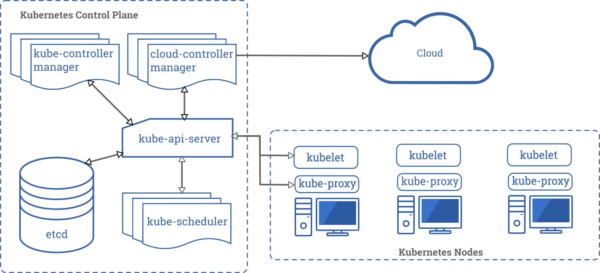

Mirror: https://tanzu.vmware.com/content/blog/kubernetes-for-product-managers

# Kubernetes for Product Managers
March 3, 2020 Miguel Luna
kubernetescloud nativeThought LeadershipDevOps Best PracticesHow-tos

You’ve probably heard the word Kubernetes, it is buzzing all over the tech world. However, any time you try to look for an article explaining why it’s so important, you only find stuff targeting executives (which can be valuable, like our CIO’s Guide to Kubernetes), or posts targeting engineers, which quickly spiral into deeply technical explanations. What you can’t find is something in between—a resource for helping product managers translate the clever architectural details that excite engineers into business outcomes that will convince your bosses you’re making the right choice by selecting Kubernetes. 

That’s what this guide hopes to do: explain Kubernetes to a less technical audience, via a simple but useful analogy. Let’s get to it. 

## So, what is Kubernetes?

Before jumping directly into a textbook “container orchestration system” definition of Kubernetes, let’s start with a story that helps illustrate some core concepts of Kubernetes:

    Kate has a cookie shop in London’s Euston station and enjoys a routine that has helped her grow her business slowly but steadily: “Everything is about keeping a healthy stock of every flavor. Every few minutes, I check the counter against the numbers I need, and restock or replace cookie bags as required,” says Kate, nodding at the tidy cookie counter in her store where different-flavored bags are on display.
    However, this year has brought major changes to Euston as the station is being expanded to include more trains, which means a significant footfall increase.

    Kate was happy about the news but knew she didn’t have enough space to keep enough cookies to satisfy the new flurry of customers, especially during rush hour. 
    Luckily for her, there are a few shops on the station with empty counters and, to Kate’s delight, its owners have told her they are happy to rent as much space as she needs, for as long as she needs it.

    Kate thinks, “All my space problems have been solved. I can easily have as many cookies I need during peak times without having to invest in more shelves or buy a whole new shop.”
    The day the station expansion is due to open, Kate gets an early start to make sure she has time to replenish her shop and the recently rented counters with plenty of cookies. A good half hour from when the morning rush began, all counters are missing cookies and Kate quickly realizes she doesn’t have enough time to bake cookies, pack them, and continuously go around her store and rental counters to check stock levels and replenish where required. 
    Kate is frustrated because she knows exactly how many cookies she wants on counters at any time, but it’s physically impossible for her to make it happen. In an ideal world, Kate would declare these numbers and get everything taken care of; she could then spend more time improving her recipes and creating new flavors instead of having to spend that precious time baking and restocking shelves.

In this story, renting counter space is like cloud computing, which solves the problem of scaling low-level resources. Baked cookies are like containers, which can be reproduced using a premixed formula of executable code, system libraries, and settings—making it possible to deploy applications easily and consistently anywhere.

Like Kate’s challenge to keep cookies adequately stocked on her now-dispersed counters, running containers at scale in distributed systems comes with an exponential increase in deployment, scaling, and management challenges. Kubernetes is a system that automates many of these difficult tasks, such as monitoring the health of a unit and making sure things that fail get rescheduled.
## Digging a little deeper

Now that we’ve explained Kubernetes at a very high level, let’s look at a more formal and more technical definition, which also is the one adopted by the open source community: Kubernetes is a portable, extensible, open-source platform for managing containerized workloads and services, that facilitates both declarative configuration and automation.

This definition contains some key terms and concepts that relate to Kate’s story, which we’ll analyze individually to get a better sense of how Kubernetes works:
Declarative configuration

Kubernetes uses a declarative model, which means you can input the desired state without having to describe how the system should achieve that state. For example, using the command ‘kubectl apply’ and pointing to a manifest file, you might update a Kubernetes cluster to have 3 replicas of a pod (more on those later) as your desired state. 

In our analogy, this would be the equivalent of Kate simply having to say how many cookies she wants at any time, knowing that the system would take care of making it happen without requiring instructions of how to do it.
Automation

Kubernetes includes a series of components called “controllers,” which help automate mundane tasks that add minimal value to the business. As a user, you declared your desired state to be 3 replicas of a pod, leaving it to the system automation to continuously perform checks and generate (when required) imperative commands to create new replicas or delete existing ones, in order to reach your desired state of 3 replicas.

Some of these tasks for Kate are having to check stock status shelf by shelf, baking, and restocking. Kate can have Kubernetes do this for her by submitting a set of declarative manifests that state her desired cookie count and leave it to a controller to compare what is on the shelves against the numbers she wants, and act to resolve any differences. 
Portable

Portability in this case means being able to move between cloud providers and/or local infrastructure platforms to avoid vendor lock-in. Every major cloud vendor supports communication with Kubernetes through the same interface. 

For Kate, portability means she could easily deploy her cookie business in another town or country by simply finding counters to rent. She could even create new franchises that come to life using the current business model template. 
## The main components of Kubernetes 

At this point, we’ll cover some of the architectural detail of Kubernetes. As most product managers would agree, it’s useful to understand technical solutions to a level that you are able to explain it in simple terms to someone else.
Clusters

A cluster is the foundation of Kubernetes. A cluster is made up of one or more machines (virtual or physical) called nodes, which are capable of running containerized applications in groups referred to as “pods.” At least one worker node and at least one master node are present in a cluster, with worker nodes being managed by the master node. When you install Kubernetes, you deploy a cluster.
Pods

A pod represents processes running on your cluster and is the smallest and simplest unit in the Kubernetes object model that you create or deploy. The user specifies, by means of a pod template, the number of containers that should run in a pod upon deployment. Pod templates are like cookie cutters: Once a cookie has been cut, the cookie has no relationship to the cutter, and changes to the pod or template are not synced in either direction.

A pod encapsulates an application’s containers, in the same fashion as how Kate’s cookies are wrapped in bags. Since pods are the most granular way Kate can control the cookie stock, she needs to declare her stock requirements in number of bags and also indicate how many cookies she wants each to hold.

 

Architecture of a Kubernetes cluster (source: kubernetes.io)
### Master node and components

Master node: The master node is the machine that will manage worker node machines. It is also referred to as the control plane.

kube-apiserver: This is the master-node component that allows communication. This is how Kate would communicate changes to her desired cookie bag count.

etcd: This is where all the Kubernetes data is stored (technically speaking, it’s a distributed key-value store file and not a database). In terms of Kate’s story, etcd would store data such as current cookie stock count, Kate’s desired stock count, and configuration of the shelves, among other details.

kube-controller manager: Every robot needs a program to tell it what to do. In the Kubernetes world, these are called controllers, which are control loops that constantly check the desired state versus current state and take corrective action when these two don’t match. It is the job of the controller manager to run these controllers.

cloud-controller-manager: This component runs the controllers that interact with the cloud providers, allowing the code of Kubernetes to remain independent. This controller would be the one serving as a translator with the different people renting out counters to Kate and ensuring individual interactions can be understood by each shelf provider.

kube-scheduler: It is the job of the kube-scheduler to assign a worker node to newly created pods. This is the equivalent of placing freshly baked cookie bags on a counter.

### Worker node and components

Worker nodes: Also referred to simply as “nodes,” worker nodes are the machines where workloads will run. In the context of Kate’s story, worker nodes are the individual shelf spaces she uses to display her cookies for sale. 

kubelet: The kubelet is responsible for feeding status information back to the master node, and also for ensuring that containers in a pod are running and healthy. The kubelet would be responsible for feeding information on the cookie-stock status and also making sure bags of cookies are on shelves as expected by customers. If a bag was to fall off the shelf, the kubelet would pick it up and put it back.

kube-proxy: The role of the kube-proxy is to manage networking for the node, making it available to be accessed by Kubernetes itself and, most importantly, from outside the cluster by someone like a customer. What would be the point of Kate having cookie bags on shelves if customers are unable to access those shelves?

Container runtime: To enable containers to run, you need a runtime. Kubernetes supports several runtimes, with Docker being among the most popular. In Kate’s story, a container runtime enables cookies to exist once they’ve been baked. To create a container, you first need a container image; it’s the same as how to create a cookie, you need a cookie-cutter.  
Other concepts

There are many other valuable concepts—including services and pod templates—that are worth exploring for a more thorough understanding of Kubernetes. Also, due to the previously mentioned extensibility of Kubernetes and how active this community is, there is an ever-growing landscape of add-ons and other tooling. Some of the more exciting areas include operator patterns, which are custom controllers that can be tailored to perform tasks that otherwise a human operator would have to perform, and Custom Resource Definitions (CRDs), which can help extend the declarative functionality of Kubernetes by managing resources that are specific to an operation.
## Sound too good to be true?

Kubernetes is great for many things, but there are some considerations to before just jumping into it. You want to avoid getting into something without knowing what challenges to expect and, more importantly, without having a clear reason for doing it (the term “blockchain startup” comes to mind here . . .).

Here are some other challenges that come along with Kubernetes as it keeps maturing, paraphrased from this blog post by Jessie Frazelle:
Stateful data is evolving but remains complex. 

There have been great advancements in how Kubernetes manages stateful data, but the administration of stateful applications and distributed systems still involves a high degree of complexity. 

In Kate’s world, stateful data can broadly be described as having to replace “like for like’” cookie bags where new toppings have been added after being on the shelf. There is a requirement to understand what was added before replacing cookies with exact replicas, because the original recipe does not hold this information.
Maintaining Kubernetes is still a job to be done. 

In the same way that robots require maintenance and software needs updating to acquire new functionality, Kubernetes requires maintenance and upgrading. This demands expertise and redundancy measures to avoid risks such as putting what could be the lifeline of your business in danger by relying on a single cluster that might break during maintenance.

The equivalent of a cluster failure for Kate might mean consequences such as cookies not being restocked, or paying for empty counter space. But, more importantly, it would leave a dent in customer trust when they come for her product and have to leave empty-handed.
Kubernetes is not the end game. 

Kubernetes is not the destination, but rather is a series of tools to help you build your end game. It is, in the words of Kelsey Hightower, a platform for building other platforms.

## What is the business value of Kubernetes?

We have compared some key concepts of Kubernetes with a loosely adapted analogy to help articulate its business value. However, the exact value of Kubernetes will depend on the particular circumstances of each company. Just because a certain technology is particularly good at solving specific problems, it does not mean every company has these problems to solve. Here is what Kubernetes really delivers to organizations that adopt it wisely:

### Reducing toil 

Kubernetes makes it easier to manage applications for development teams, by automating tasks that are repetitive and add limited business value, but that are vital nonetheless. These are things like ensuring the availability of applications.

### Lowering barriers to innovation 

The ability to self-serve with Kubernetes helps application teams accelerate their development by gaining access to infrastructure and, with minimal effort, obtaining a true reflection of how things will look in production without requiring a long process for provisioning capabilities.

### IT costs optimization 

Automation of operational tasks allows for a more reliable and less conservative approach to provisioning resources, similar to reducing the risk of stock waste by using shelves and baking cookies only as they are required. 

The convergence on Kubernetes as an infrastructure abstraction also means that operators or development teams that manage infrastructure can avoid having to deal directly with the ever-growing complexity of cloud infrastructure.
New value generation 

Freeing up time for development teams means they will have more time to focus on evolving their applications and capturing new value for the company, instead of investing this time in operational tasks. In Kate’s example, that means more time to improve cookie recipes or create new flavors.

### Increasing speed of development at scale

Microservices architecture patterns can increase development teams’ productivity and speed by decomposing applications into manageable services that are faster to develop, thus enabling continuous integration and increased fault tolerance.

However, a breakdown into smaller components also brings an increase in operational complexity by having more units to manage. This problem grows exponentially at scale. Kubernetes helps to address this specific issue in an effective, scalable, robust, and simplistic manner.  

### Avoiding vendor lock-in 

Committing to a cloud vendor can be a decision difficult to reverse, and it would not be wise to limit your choices in the face of a rapidly evolving landscape of cloud technologies. Kubernetes can  help you get the best of each provider without locking yourself into their platforms from bottom to top.  

## Now, go and apply your Kubernetes knowledge

Kubernetes is rapidly evolving. There are problems that it is great at solving, but there might be some trade-offs involved. Nevertheless, the balance of problems solved against problems created is largely positive. This means Kubernetes is not only here to stay, but is actually becoming a crossroad where many technologies are crossing paths.

Hence, it's essential for you as a product manager to understand the problems Kubernetes can help solve, and to make sure its usage will contribute to your team’s or organization’s true goals.

If you’re a product manager interested in Kubernetes and want to reach out to have a conversation, please reach out on Twitter at @mlunadia.